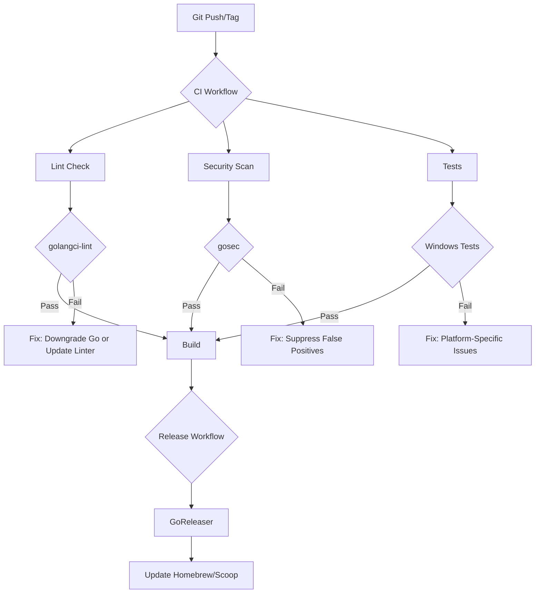

# Design Document - CI Quality Fixes

## Overview

This design addresses the failures in GitHub Actions CI and Release workflows by fixing Go version compatibility, resolving security scan findings, and ensuring Windows test compatibility. The approach prioritizes minimal code changes to restore workflow functionality while maintaining code quality and security standards.

## Steering Document Alignment

### Technical Standards (tech.md)

The fixes align with existing technical standards:
- **Maintain Go 1.25.1** as the project's target version (no downgrade)
- Continue using golangci-lint for code quality enforcement
- Pin golangci-lint to explicit versions built with Go 1.25+
- Maintain gosec for security scanning with documented exceptions
- Keep cross-platform compatibility as a core principle

### Project Structure (structure.md)

No structural changes required. Fixes will be applied to:
- Workflow configuration files (`.github/workflows/`)
- Inline code comments for security scan suppressions
- No changes to module structure or architecture

## Code Reuse Analysis

### Existing Components to Leverage

- **GitHub Actions workflows**: Extend existing `ci.yml` and `release.yml` without major restructuring
- **Go testing framework**: Use existing test infrastructure, fix platform-specific issues only
- **Security scanning tools**: Reuse existing gosec and golangci-lint integrations

### Integration Points

- **GitHub Actions**: Update action versions and configuration parameters
- **GoReleaser**: Already configured correctly, will work once workflows pass
- **Homebrew/Scoop**: Already configured, blocked by workflow failures

## Architecture

### Modular Design Principles

The fixes follow a layered approach:

1. **Workflow Layer**: Configuration changes to GitHub Actions
2. **Linter Configuration**: Compatibility adjustments for tooling
3. **Code Annotations**: Minimal inline suppressions for false positives
4. **Test Fixes**: Platform-specific test adjustments

## Components and Interfaces

### Component 1: Workflow Configuration

- **Purpose:** Configure GitHub Actions to use compatible tool versions
- **Files:**
  - `.github/workflows/ci.yml`
  - `.github/workflows/release.yml`
- **Changes:**
  - **Keep Go 1.25.1** in go.mod (no downgrade)
  - **Keep go-version: '1.25'** in all workflow jobs
  - **Pin golangci-lint to v2.5** (built with Go 1.25, supports Go 1.25 projects)
  - Change from `version: latest` to `version: v2.5` in golangci-lint-action
- **Reuses:** Existing workflow structure, only parameter updates

### Component 2: Security Scan Suppressions

- **Purpose:** Document and suppress false positive security findings
- **Files:**
  - `internal/crypto/crypto.go` (G407 suppression)
  - `internal/storage/storage.go` (G304 suppressions for backup/restore paths)
- **Changes:**
  - Add `// #nosec G407` with justification for randomly-generated nonce
  - Add `// #nosec G304` with justification for user-controlled vault paths
- **Reuses:** Existing gosec integration, standard suppression syntax

### Component 3: Windows Test Compatibility

- **Purpose:** Ensure tests pass on Windows platform
- **Files:** Test files showing failures (TBD - needs investigation)
- **Changes:** Platform-specific test adjustments or skips
- **Reuses:** Existing test framework and patterns

### Component 4: Go Version Strategy

- **Purpose:** Resolve Go version compatibility
- **Approach:** Pin golangci-lint to version built with Go 1.25+

**Implementation (Correct Solution):**
- Keep `go.mod`: `go 1.25.1` (no changes)
- Keep workflows: `go-version: '1.25'` (no changes)
- Update golangci-lint-action: `version: v2.5`
- **Rationale:** golangci-lint v2.4.0+ supports Go 1.25 when built with Go 1.25. Official binaries since v2.4.0 are built with Go 1.25. Using `version: latest` was unreliable; explicit pinning ensures correct version.
- **Source:** https://github.com/golangci/golangci-lint/issues/5873

**Why Previous Options Were Wrong:**
- ~~Option A (Downgrade Go)~~: Unnecessary regression, loses Go 1.25 features
- ~~Option B (Wait)~~: golangci-lint v2.5 already exists and supports Go 1.25
- ~~Option C (Build from source)~~: Overcomplicated when official binaries work

## Data Models

No data model changes required. This is purely operational/configuration work.

## Error Handling

### Error Scenarios

1. **Golangci-lint Version Mismatch**
   - **Handling:** Implement Option A or B from Go Version Strategy
   - **User Impact:** Developers see passing CI checks
   - **Rollback:** Revert workflow changes if issues arise

2. **Gosec False Positives**
   - **Handling:** Add `#nosec` suppressions with clear justifications
   - **User Impact:** Security scan passes, real issues still caught
   - **Validation:** Review each suppression for legitimacy

3. **Windows Test Failures**
   - **Handling:** Fix platform-specific code or mark tests as platform-conditional
   - **User Impact:** Cross-platform confidence restored
   - **Validation:** Verify tests pass on all platforms

4. **GoReleaser Publish Failures**
   - **Handling:** Ensure all prerequisite jobs pass before release job runs
   - **User Impact:** Automated releases work end-to-end
   - **Validation:** Test with v1.0.2 tag after fixes

## Testing Strategy

### Unit Testing

- **No new unit tests required** - fixing existing test compatibility
- Validate all existing tests pass on Windows after fixes
- Ensure no regression on macOS/Linux

### Integration Testing

- Test complete CI workflow on pull request
- Verify lint, security scan, and tests all pass
- Confirm build artifacts are generated correctly

### End-to-End Testing

**Release Workflow Validation:**
1. Create test tag (e.g., v1.0.2-test)
2. Verify release workflow completes successfully
3. Confirm GoReleaser builds all platforms
4. Validate Homebrew formula is auto-updated in `homebrew-tap` repo
5. Validate Scoop manifest is auto-updated in `scoop-bucket` repo
6. Test installation via both package managers
7. Clean up test tag after validation

**Platform-Specific Testing:**
- Run full test suite on Windows, macOS, Linux
- Verify binary functionality on all platforms
- Confirm no race conditions detected

## Implementation Approach

### Phase 1: Quick Wins (Immediate)
1. Fix golangci-lint compatibility (Option A: temp downgrade)
2. Suppress gosec false positives with documentation
3. Validate CI passes

### Phase 2: Investigate and Fix (Short-term)
1. Investigate Windows test failures
2. Fix platform-specific issues
3. Validate end-to-end on all platforms

### Phase 3: Optimize (Medium-term)
1. Upgrade to Go 1.25 when golangci-lint supports it
2. Review all security suppressions for continued validity
3. Optimize workflow run times

## Success Criteria

- ✅ All GitHub Actions workflows pass (CI + Release)
- ✅ golangci-lint completes with exit code 0
- ✅ gosec completes with no critical findings
- ✅ All tests pass on Windows, macOS, and Linux
- ✅ Automated release creates GitHub Release with all artifacts
- ✅ Homebrew tap auto-updates on release
- ✅ Scoop bucket auto-updates on release
- ✅ No regression in code quality or security posture
