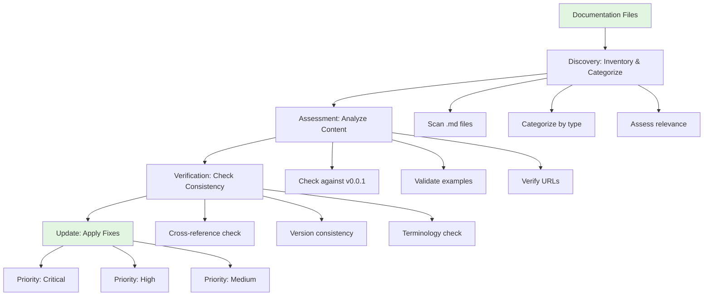

# Design Document

## Overview

The documentation review and update system will systematically audit all 24+ markdown files in the Pass-CLI repository, assess their accuracy against the v0.0.1 release, and produce a comprehensive update plan with prioritized tasks. The design follows a phased approach: (1) automated inventory with categorization, (2) manual verification of critical content, (3) consistency checking across documents, and (4) structured updates with tracking.

## Steering Document Alignment

### Technical Standards (tech.md)

This design aligns with tech.md standards:
- **Go Standards**: Documentation will be verified against actual Go 1.25+ implementation (go.mod versions, actual CLI flags)
- **Security Practices**: SECURITY.md validation will confirm documentation matches cryptographic implementation (AES-256-GCM, PBKDF2 with 100k iterations per tech.md)
- **CLI Design**: USAGE.md verification will ensure documented commands match Cobra command structure with correct flags (--quiet, --field, --masked, --no-clipboard; NOT --json which is future)
- **Testing**: All code examples in documentation will be validated as working (executable documentation principle)
- **Script-Friendly Output**: Ensure examples use only implemented flags (--quiet and --field for v0.0.1, not --json)

### Project Structure (structure.md)

The design respects project organization:
- **User Documentation**: Root-level docs (README.md, INSTALLATION.md, USAGE.md) remain in project root for discoverability
- **Developer Documentation**: Docs in `/docs` directory maintain separation of concerns
- **Platform-Specific**: `/manifests` subdirectory documentation remains colocated with configurations
- **Test Documentation**: `/test/README.md` stays with test code

## Code Reuse Analysis

### Existing Components to Leverage

- **GitHub CLI (`gh`)**: Use for verifying repository URLs, release assets, workflow badges
- **Git Commands**: Verify current version tags, check remote URLs, validate repository state
- **GoReleaser Config**: Read `.goreleaser.yml` to verify documented features match actual build configuration
- **Workflow Files**: Parse `.github/workflows/*.yml` to validate CI-CD.md accuracy
- **go.mod**: Extract Go version and dependencies for DEVELOPMENT.md validation

### Integration Points

- **Live v0.0.1 Release**: Verify installation instructions against actual GitHub release artifacts
- **Package Repositories**: Check actual Homebrew tap and Scoop bucket for documentation accuracy
- **CLI Implementation**: Execute `pass-cli --help` and subcommands to validate documented syntax
- **Test Suite**: Reference existing test files to ensure documented features are actually tested

## Architecture

The documentation review system follows a pipeline architecture with four distinct phases:

1. **Discovery Phase**: Automated file scanning and initial categorization
2. **Assessment Phase**: Content analysis with sync status determination
3. **Verification Phase**: Cross-reference validation and consistency checking
4. **Update Phase**: Prioritized task execution with change tracking

### Modular Design Principles

- **Single File Responsibility**: Each documentation file has one clear purpose (user guide vs developer guide vs operational guide)
- **Component Isolation**: Review tasks are independent and can be executed in any order within priority tiers
- **Service Layer Separation**: Inventory logic separate from verification logic separate from update logic
- **Utility Modularity**: Reusable verification scripts (URL checker, command validator, version extractor)



## Components and Interfaces

### Component 1: Documentation Inventory System
- **Purpose:** Scan repository, categorize all documentation files, and create structured inventory
- **Interfaces:**
  - `findAllDocs()`: Returns list of markdown file paths (excluding .spec-workflow, node_modules)
  - `categorizeDoc(filePath)`: Returns category (user/developer/operational/obsolete)
  - `assessRelevance(filePath)`: Returns relevance status (needed/deprecated/unclear)
- **Dependencies:** File system access, README content analysis
- **Reuses:** Bash `find` command, file path parsing

### Component 2: Content Verification Engine
- **Purpose:** Validate documentation content against actual implementation and steering documents
- **Interfaces:**
  - `verifyInstallationInstructions()`: Checks URLs, commands, version numbers
  - `verifyCommandExamples(examples)`: Executes examples to ensure they work
  - `verifyVersionReferences(doc)`: Ensures all version mentions are v0.0.1
  - `verifyRepositoryURLs(doc)`: Validates GitHub URLs are not placeholders
  - `verifyFlagDocumentation()`: Ensures only implemented flags documented (--quiet, --field, --masked, --no-clipboard; NOT --json)
  - `verifySteeringAlignment()`: Cross-checks docs against product.md and tech.md specifications
- **Dependencies:** Git, GitHub CLI, Pass-CLI binary, GoReleaser config, steering documents
- **Reuses:** `gh release view`, `git remote -v`, CLI help output parsing, steering doc validation

### Component 3: Consistency Checker
- **Purpose:** Ensure information is consistent across all documentation
- **Interfaces:**
  - `checkVersionConsistency()`: Verifies same version across all docs
  - `checkFeatureDescriptions()`: Compares feature lists in README vs USAGE vs SECURITY
  - `checkTerminology()`: Validates consistent term usage
  - `validateCrossReferences()`: Checks internal links work
- **Dependencies:** All documentation files, link validator
- **Reuses:** Markdown link parser, grep for term search

### Component 4: Update Execution System
- **Purpose:** Apply fixes to documentation in prioritized order with tracking
- **Interfaces:**
  - `createUpdateTasks()`: Generates task list from verification findings
  - `prioritizeTasks()`: Orders tasks by criticality (critical/high/medium/low)
  - `executeUpdate(task)`: Applies fix and validates result
  - `trackChanges()`: Documents what was changed and why
- **Dependencies:** File editing tools, git for change tracking
- **Reuses:** Edit tool from MCP, git diff for validation

## Data Models

### DocumentInventoryEntry
```go
type DocumentInventoryEntry struct {
    FilePath         string               // Relative path from repo root
    Category         DocumentCategory     // user/developer/operational/obsolete
    Relevance        RelevanceStatus      // needed/deprecated/unclear
    SyncStatus       SyncStatus          // in-sync/out-of-sync/needs-verification
    Priority         UpdatePriority      // critical/high/medium/low
    Issues           []DocumentIssue     // Specific problems found
    LastModified     time.Time           // Git last modified date
    Purpose          string              // Brief description of doc's purpose
}

type DocumentCategory string
const (
    CategoryUser        DocumentCategory = "user"
    CategoryDeveloper   DocumentCategory = "developer"
    CategoryOperational DocumentCategory = "operational"
    CategoryObsolete    DocumentCategory = "obsolete"
)

type SyncStatus string
const (
    SyncInSync           SyncStatus = "in-sync"
    SyncOutOfSync        SyncStatus = "out-of-sync"
    SyncNeedsVerification SyncStatus = "needs-verification"
)

type UpdatePriority string
const (
    PriorityCritical UpdatePriority = "critical"
    PriorityHigh     UpdatePriority = "high"
    PriorityMedium   UpdatePriority = "medium"
    PriorityLow      UpdatePriority = "low"
)
```

### DocumentIssue
```go
type DocumentIssue struct {
    IssueType    IssueType  // broken-link/outdated-info/placeholder/incorrect-example/inconsistency
    Description  string     // Human-readable issue description
    Location     string     // Line number or section identifier
    Severity     string     // critical/high/medium/low
    SuggestedFix string     // Proposed solution
}

type IssueType string
const (
    IssueBrokenLink       IssueType = "broken-link"
    IssueOutdatedInfo     IssueType = "outdated-info"
    IssuePlaceholder      IssueType = "placeholder"
    IssueIncorrectExample IssueType = "incorrect-example"
    IssueInconsistency    IssueType = "inconsistency"
    IssueMissingInfo      IssueType = "missing-info"
    IssueWrongVersion     IssueType = "wrong-version"
    IssueUnimplementedFeature IssueType = "unimplemented-feature"  // e.g., documenting --json when not implemented
    IssueSteeringMismatch IssueType = "steering-mismatch"  // Conflicts with product.md or tech.md
)
```

### UpdateTask
```go
type UpdateTask struct {
    TaskID       string         // Unique identifier
    FilePath     string         // Document to update
    IssueType    IssueType      // Type of issue being fixed
    Description  string         // What needs to be done
    Priority     UpdatePriority // Execution priority
    OldContent   string         // Current incorrect content
    NewContent   string         // Corrected content
    Rationale    string         // Why this change is needed
    Status       TaskStatus     // pending/in-progress/completed
}

type TaskStatus string
const (
    TaskPending    TaskStatus = "pending"
    TaskInProgress TaskStatus = "in-progress"
    TaskCompleted  TaskStatus = "completed"
)
```

## Error Handling

### Error Scenarios

1. **Scenario: Broken External Links**
   - **Handling:** Attempt to resolve link, check if resource moved, suggest alternative or mark for manual review
   - **User Impact:** Clear indication in inventory that link needs attention, suggested fixes provided

2. **Scenario: Command Example Fails Execution**
   - **Handling:** Capture error output, compare with current CLI help text, identify syntax difference
   - **User Impact:** Example marked as broken with specific error message and corrected syntax proposal

3. **Scenario: Version Mismatch Across Documents**
   - **Handling:** Identify all version references, determine canonical version (v0.0.1), generate update list
   - **User Impact:** Consistency report showing which docs need version updates

4. **Scenario: Placeholder URLs Detected**
   - **Handling:** Parse URL, identify placeholder pattern (yourusername, example.com), extract real URL from git remote
   - **User Impact:** All placeholders flagged with actual URLs ready for substitution

5. **Scenario: Missing Critical Documentation**
   - **Handling:** Cross-reference feature list in product.md with documented features, identify gaps (e.g., --masked and --no-clipboard flags)
   - **User Impact:** Report shows undocumented features that need new documentation sections

6. **Scenario: Documenting Unimplemented Features**
   - **Handling:** Detect mentions of future features (like --json) in user-facing docs, flag for removal or relabeling as "future"
   - **User Impact:** Clear distinction between v0.0.1 features and future enhancements per product.md Future Vision section

7. **Scenario: Steering Document Conflicts**
   - **Handling:** Compare doc claims with product.md and tech.md, flag conflicts (e.g., wrong PBKDF2 iteration count)
   - **User Impact:** Authoritative steering docs determine correct information

6. **Scenario: Obsolete Documentation with No Clear Owner**
   - **Handling:** Flag as "needs-decision", provide context on when created and last modified
   - **User Impact:** Presents to maintainer for decision on keep/archive/delete

## Testing Strategy

### Unit Testing
- **Inventory Scanner**: Verify correct file discovery and categorization with test fixtures
- **URL Validator**: Test with valid URLs, broken URLs, placeholder URLs
- **Version Extractor**: Verify correct extraction from various document formats
- **Consistency Checker**: Test detection of inconsistent terms, versions, feature descriptions

### Integration Testing
- **End-to-End Inventory**: Run full inventory on actual repository, validate output structure
- **Command Example Validation**: Execute all documented command examples in clean environment
- **Cross-Document Verification**: Test consistency checking across multiple related docs
- **Update Application**: Apply sample updates and verify docs are correctly modified

### Manual Verification (Required)
- **Content Accuracy**: Human review of technical descriptions to ensure accuracy
- **Installation Steps**: Manual execution of documented installation procedures on each platform
- **Usage Examples**: Follow quick start guide as new user to ensure completeness
- **Link Functionality**: Click through all hyperlinks to verify destinations are correct

## Update Workflow

### Phase 1: Inventory Creation (Automated)
1. Scan repository for all .md files
2. Categorize each document
3. Extract metadata (last modified, size, purpose)
4. Generate inventory JSON/markdown report

### Phase 2: Critical Path Verification (Semi-Automated)
1. Verify README.md (installation URLs, version, features)
2. Verify INSTALLATION.md (package manager instructions)
3. Verify USAGE.md (command examples)
4. Verify SECURITY.md (crypto details)
5. Generate priority task list

### Phase 3: Consistency Checking (Automated)
1. Extract all version references → check consistency
2. Extract all feature descriptions → check alignment
3. Extract all repository URLs → validate and check consistency
4. Validate all internal cross-references
5. Generate inconsistency report

### Phase 4: Update Execution (Manual with Tracking)
1. Sort tasks by priority (critical → high → medium → low)
2. For each task:
   - Read current content
   - Apply fix using Edit tool
   - Validate fix (re-run verification)
   - Mark task complete in tasks.md
3. Final consistency re-check
4. Commit all documentation updates

## Success Criteria

- **Zero Placeholder URLs**: All "yourusername" and placeholder URLs replaced
- **Zero Broken Links**: All internal and external links functional
- **Version Consistency**: All docs reference v0.0.1
- **Working Examples**: All command examples execute successfully
- **Complete Coverage**: All v0.0.1 features documented per product.md (including --masked, --no-clipboard)
- **No Future Features Documented as Current**: --json and other Future Vision items clearly labeled or removed from v0.0.1 docs
- **Steering Alignment**: All technical specs match tech.md (Go 1.25+, PBKDF2 100k iterations, correct dependency versions)
- **Feature Accuracy**: Only implemented flags documented (--quiet, --field, --masked, --no-clipboard)
- **Platform Parity**: Windows, macOS, Linux docs are complete and accurate
- **Single Source of Truth**: No conflicting information across docs or with steering documents
