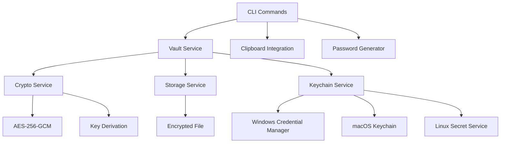

# Design Document

## Overview

Pass-CLI is designed as a modular, secure command-line password manager built in Go. The architecture follows clean separation of concerns with distinct layers for cryptography, storage, keychain integration, and CLI interface. The design prioritizes security, cross-platform compatibility, and developer experience while maintaining a lightweight footprint suitable for local development workflows.

## Steering Document Alignment

### Technical Standards (tech.md)
This is a new project, so we'll establish technical standards through this implementation:
- Go 1.21+ for modern language features and security improvements
- Standard library preference with minimal external dependencies
- Cobra CLI framework (industry standard used by kubectl, gh, docker)
- AES-256-GCM encryption following NIST recommendations
- PBKDF2 key derivation with 100,000+ iterations

### Project Structure (structure.md)
Following Go project layout conventions:
- `cmd/` for application entry points
- `internal/` for private application code
- Clear package separation by domain responsibility
- Standard Go module structure with semantic versioning

## Code Reuse Analysis

### Existing Components to Leverage
Since this is a new project, we'll build from Go standard library and established patterns:
- **crypto/aes, crypto/cipher**: Standard library encryption primitives
- **golang.org/x/crypto/pbkdf2**: Secure key derivation
- **spf13/cobra**: Battle-tested CLI framework
- **spf13/viper**: Configuration management
- **zalando/go-keyring**: Cross-platform keychain integration

### Integration Points
- **System Keychain**: Windows Credential Manager, macOS Keychain, Linux Secret Service
- **File System**: User home directory for vault storage (`~/.pass-cli/`)
- **Clipboard**: Cross-platform clipboard integration for credential copying
- **Package Managers**: Distribution via Homebrew, Scoop, and direct binary releases

## Architecture

The system follows a layered architecture with clear separation between security, storage, and user interface concerns. Each layer has well-defined interfaces enabling testability and maintainability.

### Modular Design Principles
- **Single File Responsibility**: Each Go file handles one specific domain (crypto, storage, keychain, commands)
- **Component Isolation**: Crypto layer independent of storage, CLI independent of business logic
- **Service Layer Separation**: Clear boundaries between data access, encryption, and presentation
- **Utility Modularity**: Focused packages for password generation, clipboard operations, etc.



## Components and Interfaces

### Crypto Service (`internal/crypto/crypto.go`)
- **Purpose:** Handle all encryption/decryption operations using AES-256-GCM
- **Interfaces:**
  - `Encrypt(data []byte, password string) ([]byte, error)`
  - `Decrypt(encryptedData []byte, password string) ([]byte, error)`
  - `DeriveKey(password string, salt []byte) []byte`
- **Dependencies:** Go standard library crypto packages
- **Reuses:** crypto/aes, crypto/cipher, crypto/rand, golang.org/x/crypto/pbkdf2

### Storage Service (`internal/storage/storage.go`)
- **Purpose:** Manage encrypted vault file operations and data persistence
- **Interfaces:**
  - `LoadVault(password string) (*Vault, error)`
  - `SaveVault(vault *Vault, password string) error`
  - `VaultExists() bool`
  - `InitVault(password string) error`
- **Dependencies:** Crypto service, file system operations
- **Reuses:** os, path/filepath, encoding/json

### Keychain Service (`internal/keychain/keychain.go`)
- **Purpose:** Integrate with system keychains for master password storage
- **Interfaces:**
  - `StoreMasterPassword(password string) error`
  - `RetrieveMasterPassword() (string, error)`
  - `IsAvailable() bool`
  - `DeleteMasterPassword() error`
- **Dependencies:** Platform-specific keychain APIs
- **Reuses:** github.com/zalando/go-keyring

### Vault Service (`internal/vault/vault.go`)
- **Purpose:** Core business logic for credential management
- **Interfaces:**
  - `AddCredential(service, username, value string) error`
  - `GetCredential(service string) (*Credential, error)`
  - `ListCredentials() []string`
  - `UpdateCredential(service, username, value string) error`
  - `DeleteCredential(service string) error`
- **Dependencies:** Storage and Crypto services
- **Reuses:** All internal services

### CLI Commands (`cmd/*.go`)
- **Purpose:** Command-line interface using Cobra framework
- **Interfaces:** Standard Cobra command structure with RunE functions
- **Dependencies:** Vault service, clipboard utilities, password generator
- **Reuses:** github.com/spf13/cobra, github.com/spf13/viper

## Data Models

### Credential
```go
type Credential struct {
    Service   string    `json:"service"`
    Username  string    `json:"username"`
    Value     string    `json:"value"`
    CreatedAt time.Time `json:"created_at"`
    UpdatedAt time.Time `json:"updated_at"`
}
```

### Vault
```go
type Vault struct {
    Version     string                `json:"version"`
    CreatedAt   time.Time            `json:"created_at"`
    UpdatedAt   time.Time            `json:"updated_at"`
    Credentials map[string]Credential `json:"credentials"`
}
```

### EncryptedVault (File Format)
```go
type EncryptedVault struct {
    Version    string `json:"version"`
    Salt       []byte `json:"salt"`        // For PBKDF2
    Nonce      []byte `json:"nonce"`       // For AES-GCM
    Ciphertext []byte `json:"ciphertext"`  // Encrypted vault data
}
```

## Error Handling

### Error Scenarios
1. **Invalid Master Password**
   - **Handling:** Return specific error, increment failed attempt counter
   - **User Impact:** Clear error message, option to retry or reset vault

2. **Keychain Unavailable**
   - **Handling:** Fall back to password prompts, log warning
   - **User Impact:** Seamless operation with manual password entry

3. **Vault File Corruption**
   - **Handling:** Attempt backup recovery, validate checksums
   - **User Impact:** Error message with recovery options

4. **Service Not Found**
   - **Handling:** Return not found error with similar service suggestions
   - **User Impact:** Helpful error with suggested matches from existing services

5. **Clipboard Access Denied**
   - **Handling:** Display credential on screen with warning
   - **User Impact:** Manual copy option with security notice

## Testing Strategy

### Unit Testing
- Crypto service: Test encryption/decryption with known vectors
- Storage service: Test vault operations with temporary files
- Keychain service: Mock keychain operations for cross-platform testing
- Vault service: Test business logic with in-memory storage

### Integration Testing
- End-to-end vault operations: init → add → get → update → delete
- Keychain integration: Store and retrieve master password
- Cross-platform compatibility: Test on Windows, macOS, Linux
- File system operations: Permissions, corruption recovery

### End-to-End Testing
- Complete user workflows: Fresh install through daily usage
- Error scenarios: Invalid passwords, corrupted files, missing keychain
- Performance testing: Large vaults (1000+ credentials)
- Security testing: Memory analysis, temporary file cleanup