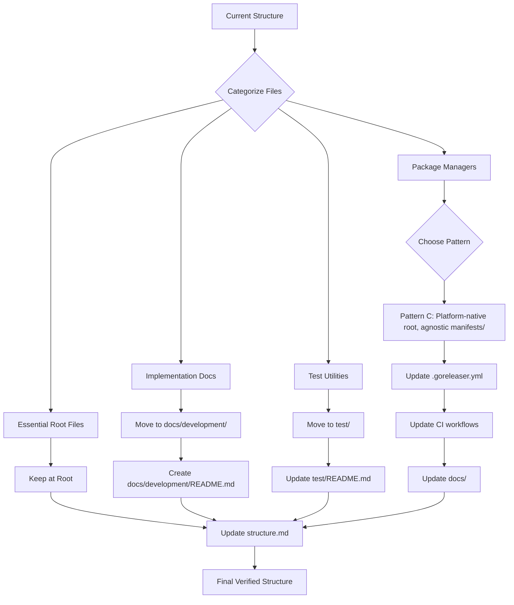

# Design Document

## Overview

This design addresses repository organization and cleanup for pass-cli. The current structure has evolved organically, resulting in root-level clutter with implementation artifacts, inconsistent package manager organization (some at root, some in manifests/), and documentation that doesn't match structure.md.

The reorganization strategy:
1. **Root Directory Cleanup** - Move implementation docs to docs/development/, keep only essential project files at root
2. **Package Manager Consolidation** - Adopt Pattern C (platform-native at root, platform-agnostic in manifests/)
3. **Documentation Organization** - Create docs/development/ for implementation notes, ensure all subdirectories have READMEs
4. **Structure.md Synchronization** - Update steering doc to accurately reflect final repository structure
5. **Atomic Updates** - Update all references (CI, docs, .goreleaser.yml) simultaneously with file moves

This ensures the repository is clean, navigable, and aligned with documented standards.

## Steering Document Alignment

### Technical Standards (tech.md)

**Go Best Practices**:
- Follows Go ecosystem conventions for project structure (standard directories at root: cmd/, internal/, test/)
- Maintains clean root directory with only essential files (README, LICENSE, go.mod, main.go, Makefile)
- Package manager configs organized consistently (pattern documented in structure.md)

**Code Quality Tools**:
- Organized structure supports linter and test tool execution
- Clear separation between source code, tests, documentation, and distribution configs
- CI/CD workflows benefit from predictable file locations

**Dependency Direction**:
- File reorganization doesn't affect import paths (Go uses module paths)
- External tools (goreleaser, CI) updated atomically to reference new paths
- Documentation links updated to prevent broken references

### Project Structure (structure.md)

**Current State Analysis**:
- structure.md documents `cmd/`, `internal/`, `test/`, `docs/` - these exist and are correct
- structure.md missing: `manifests/`, `homebrew/`, `scoop/`, `test-vault/`, root-level implementation docs
- Actual structure has more directories than documented

**Target State**:
- structure.md will comprehensively document ALL directories including package managers
- Each major directory will have purpose explanation and key files listed
- Pattern for package managers will be explicitly stated
- File counts and organization principles will be clear

**Alignment**:
- Design follows structure.md principles: "One primary type per file", "Related functionality grouped"
- Extends these principles to entire repository organization
- Makes structure.md the single source of truth for navigation

## Code Reuse Analysis

### Existing Components to Leverage

- **Git**: All file moves will use `git mv` to preserve history and ensure atomic operations
- **CI Workflows (.github/workflows/)**: Existing workflows will be updated to reference new paths
- **GoReleaser (.goreleaser.yml)**: Config will be updated for any package manager path changes
- **Documentation Links**: Existing doc cross-references will be updated to prevent broken links

### Integration Points

- **.goreleaser.yml**: References homebrew/ and scoop/ for release artifact generation
- **CI Workflows**: May reference test scripts or documentation for validation
- **README.md**: Links to docs/ for user guides and installation instructions
- **Test Scripts**: May reference test data directories or utilities

## Architecture

This is a file reorganization project, not a code architecture change. The "architecture" is the directory structure itself.

### Reorganization Strategy



### Modular Design Principles

- **Single Directory Responsibility**: Each directory has one clear purpose
  - `cmd/`: CLI commands
  - `internal/`: Private packages
  - `test/`: Integration tests and test utilities
  - `docs/`: All documentation (user-facing, archived, development)
  - `homebrew/`, `scoop/`: Platform-native package managers
  - `manifests/`: Platform-agnostic package managers (snap, winget)

- **Documentation Hierarchy**:
  - `docs/`: Current user-facing documentation
  - `docs/development/`: Implementation notes and dev tracking
  - `docs/archive/`: Historical/superseded documentation

- **Clear Categorization**: Files grouped by purpose and lifecycle
  - Active vs archived
  - User-facing vs developer-facing
  - Source code vs distribution configs

## Components and Interfaces

### Component 1: Root Directory Cleanup

- **Purpose:** Remove clutter from root, maintain only essential project files
- **Files to Keep at Root:**
  - README.md, LICENSE, go.mod, go.sum, main.go, Makefile
  - .gitignore, .goreleaser.yml
  - .github/ (directory)
  - .spec-workflow/ (directory)
  - Platform-native package managers: homebrew/, scoop/
- **Files to Move:**
  - `DASHBOARD_IMPLEMENTATION_SUMMARY.md` → `docs/development/DASHBOARD_IMPLEMENTATION_SUMMARY.md`
  - `DASHBOARD_TESTING_CHECKLIST.md` → `docs/development/DASHBOARD_TESTING_CHECKLIST.md`
  - `KEYBINDINGS_AUDIT.md` → `docs/development/KEYBINDINGS_AUDIT.md`
  - `test-tui.bat` → `test/test-tui.bat`
- **Dependencies:** Git for history-preserving moves

### Component 2: Package Manager Organization (Pattern C)

- **Purpose:** Consistent organization - platform-native at root, platform-agnostic in manifests/
- **Rationale for Pattern C:**
  - homebrew/ and scoop/ are platform-native tools with established conventions (homebrew taps, scoop buckets)
  - snap/ and winget/ are cross-platform manifest systems that fit naturally in manifests/
  - Balances discoverability (platform-native at root) with organization (manifests grouped)
  - Minimal disruption (homebrew/ and scoop/ already at root)

- **Current Structure:**
  - ✅ `homebrew/pass-cli.rb` (stays at root)
  - ✅ `scoop/pass-cli.json` (stays at root)
  - ✅ `manifests/snap/` (stays in manifests/)
  - ✅ `manifests/winget/` (stays in manifests/)

- **No moves needed, only documentation updates**

- **Dependencies:**
  - .goreleaser.yml references homebrew/ and scoop/
  - CI workflows may reference package configs for validation
  - INSTALLATION.md documents package manager installation

### Component 3: Documentation Structure Enhancement

- **Purpose:** Organize documentation by purpose with clear hierarchy
- **New Structure:**
  ```
  docs/
  ├── README.md (index of all docs with descriptions)
  ├── INSTALLATION.md (user-facing)
  ├── USAGE.md (user-facing)
  ├── SECURITY.md (user-facing)
  ├── TROUBLESHOOTING.md (user-facing)
  ├── DEVELOPMENT.md (contributor guide)
  ├── RELEASE.md (maintainer guide)
  ├── CI-CD.md (maintainer guide)
  ├── HOMEBREW.md (maintainer guide)
  ├── SCOOP.md (maintainer guide)
  ├── development/ (NEW)
  │   ├── README.md (explains purpose: "Implementation tracking docs, not user-facing")
  │   ├── DASHBOARD_IMPLEMENTATION_SUMMARY.md
  │   ├── DASHBOARD_TESTING_CHECKLIST.md
  │   └── KEYBINDINGS_AUDIT.md
  └── archive/
      ├── README.md (explains: "Historical docs, kept for reference")
      ├── RELEASE-DRY-RUN.md
      └── SECURITY-AUDIT.md
  ```

- **Dependencies:** README links will be updated to reference new locations

### Component 4: Test Organization Enhancement

- **Purpose:** Clarify test types and improve test utilities organization
- **Changes:**
  - Move `test-tui.bat` from root to `test/test-tui.bat`
  - Update `test/README.md` to document:
    - Test types: unit (*_test.go adjacent), integration (test/*.go)
    - How to run: `go test ./...` for all, `go test ./test` for integration only
    - Test utilities: test-tui.bat for manual TUI testing
    - Test data: test-vault/ for integration test fixtures

- **Current Test Files:**
  - Unit tests: Colocated with source (*_test.go)
  - Integration tests: test/integration_test.go, test/tui_*_test.go, test/keychain_integration_test.go
  - Test utilities: test-tui.bat (to be moved), test-vault/ (documented)

- **Dependencies:** test-tui.bat may reference vault paths or executables

### Component 5: Structure.md Comprehensive Update

- **Purpose:** Make structure.md the single source of truth for repository navigation
- **Updates Needed:**
  1. Add missing directories to structure.md:
     - `homebrew/` - Homebrew tap formula
     - `scoop/` - Scoop bucket manifest
     - `manifests/` - Platform-agnostic package managers (snap, winget)
     - `test-vault/` - Integration test fixture data
     - `docs/development/` - Implementation tracking docs

  2. Update Directory Organization section with accurate tree

  3. Add new section "Package Manager Organization":
     ```
     ## Package Manager Organization

     Pass-CLI uses Pattern C for package manager configuration:
     - **Platform-Native (Root)**: homebrew/, scoop/ - tools with established root conventions
     - **Platform-Agnostic (manifests/)**: snap/, winget/ - cross-platform manifest systems

     When adding new package managers:
     - If platform-native with root convention → place at root
     - If cross-platform manifest system → place in manifests/
     ```

  4. Update documentation section to reflect docs/development/ and improved archive/

- **Dependencies:** Must be updated AFTER all file moves are complete

## Data Models

### File Move Manifest

```yaml
moves:
  - from: DASHBOARD_IMPLEMENTATION_SUMMARY.md
    to: docs/development/DASHBOARD_IMPLEMENTATION_SUMMARY.md
    type: implementation_doc

  - from: DASHBOARD_TESTING_CHECKLIST.md
    to: docs/development/DASHBOARD_TESTING_CHECKLIST.md
    type: implementation_doc

  - from: KEYBINDINGS_AUDIT.md
    to: docs/development/KEYBINDINGS_AUDIT.md
    type: implementation_doc

  - from: test-tui.bat
    to: test/test-tui.bat
    type: test_utility

new_files:
  - path: docs/development/README.md
    purpose: Explain implementation tracking docs purpose

  - path: docs/README.md  (update existing)
    purpose: Index all documentation with descriptions

reference_updates:
  - file: README.md
    update: Links to docs if any reference moved files

  - file: test/README.md
    update: Document test-tui.bat utility and test-vault/ purpose

  - file: .spec-workflow/steering/structure.md
    update: Add missing directories, update tree, add package manager section
```

### Directory Purpose Matrix

| Directory | Purpose | User Type | Lifecycle |
|-----------|---------|-----------|-----------|
| cmd/ | CLI commands | Developer | Active |
| internal/ | Private packages | Developer | Active |
| test/ | Integration tests | Developer | Active |
| docs/ | User documentation | User/Developer | Active |
| docs/development/ | Implementation notes | Developer | Active |
| docs/archive/ | Historical docs | Developer | Archived |
| homebrew/ | Homebrew formula | Maintainer | Active |
| scoop/ | Scoop manifest | Maintainer | Active |
| manifests/ | Platform-agnostic configs | Maintainer | Active |
| test-vault/ | Test fixtures | Developer | Active |

## Error Handling

### Error Scenarios

1. **Scenario: Broken links after file moves**
   - **Handling:** Run link checker after moves, update all references atomically
   - **User Impact:** No impact if handled correctly; broken docs if not caught

2. **Scenario: CI workflow failures after package manager path changes**
   - **Handling:** Update .goreleaser.yml and CI workflows in same commit as any path changes
   - **User Impact:** No impact (internal only); release process broken if not updated correctly

3. **Scenario: Git history loss on file moves**
   - **Handling:** Use `git mv` instead of delete+create to preserve history
   - **User Impact:** Developers can still trace file history using `git log --follow`

4. **Scenario: Structure.md becomes outdated again**
   - **Handling:** Add note in structure.md: "When adding directories, update this doc"
   - **User Impact:** Future confusion if not maintained; minimal if documented

## Testing Strategy

### Validation Testing

Since this is file reorganization, "testing" means verification:

1. **Build Verification**
   - Run `go build` after all moves
   - Verify no import path breakage
   - Confirm binary builds successfully

2. **Test Suite Execution**
   - Run `go test ./...` after moves
   - Run integration tests: `go test ./test`
   - Verify test-tui.bat works from new location

3. **CI Workflow Validation**
   - Trigger CI workflow on PR branch
   - Verify all CI checks pass
   - Confirm release workflow dry-run succeeds (if goreleaser updated)

4. **Link Checking**
   - Check all documentation links are valid
   - Verify README links point to correct locations
   - Ensure docs/ cross-references work

5. **Structure.md Accuracy**
   - Manual walkthrough: navigate repo using only structure.md
   - Verify all documented directories exist
   - Confirm all actual directories are documented

### Rollback Plan

If issues arise:
- All changes in single commit (or atomic PR)
- Can revert commit to restore original structure
- Git history preserved via `git mv`, so no data loss
