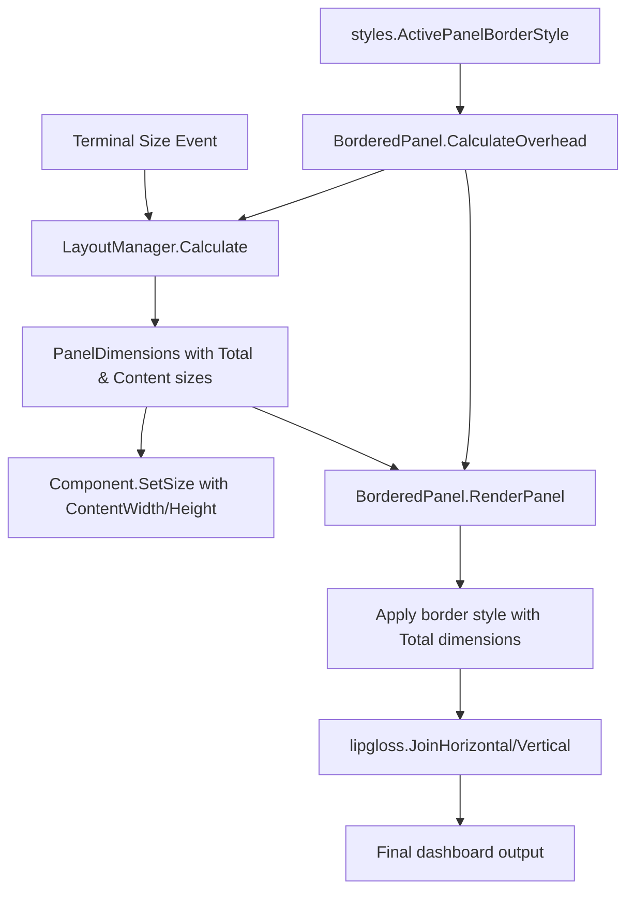

# Design Document

## Overview

This design addresses the systematic layout calculation problem in the Pass-CLI TUI dashboard. The current implementation has inconsistent border overhead handling (hardcoded `borderWidth = 4`), duplicated calculations, and fails to use Lipgloss's built-in frame size methods.

The solution leverages Lipgloss's built-in functionality:
1. **Use Lipgloss GetFrameSize() methods** - Replace custom overhead calculation with `style.GetHorizontalFrameSize()` and `style.GetVerticalFrameSize()`
2. **Enhanced LayoutManager** - Returns both total allocated dimensions and content dimensions per panel using frame size methods
3. **Simplified rendering** - Use frame size methods directly in renderDashboardView() to calculate content dimensions
4. **Remove hardcoded constants** - Eliminate all `const borderWidth = 4` and use dynamic frame size calculation

This ensures all panels render perfectly within terminal bounds with visible borders on all sides, using proven library methods instead of custom abstractions.

## Steering Document Alignment

### Technical Standards (tech.md)

**TUI Layer Architecture** (from tech.md Application Architecture):
- Aligns with "Responsive Layout System: Multi-panel dashboard with breakpoint-based adaptation"
- Aligns with "Styles & Theming: Lipgloss-based styling with consistent color scheme and borders"
- This design fixes the layout system to properly fulfill these architectural goals

**Decision #9 - Bubble Tea TUI Framework**:
- "Clean separation between state logic and rendering" - Frame size calculation separated from rendering logic
- "Composable components and message-based communication" - GetFrameSize() methods work with all styled components

**Decision #10 - Lipgloss Layout System**:
- "Automatic width/height calculation with border and padding support" - We now use Lipgloss's built-in `GetFrameSize()` methods to leverage this
- "Composable layout primitives (JoinHorizontal, JoinVertical)" - Design preserves existing composition, fixes dimension inputs
- "Declarative styling with CSS-like API" - We use style methods directly instead of wrapping them

**Layered Architecture**: The design maintains clear separation of concerns:
- **Layout Layer** (LayoutManager): Pure dimension calculation, no rendering logic
- **Rendering Layer** (helpers.go): Uses layout dimensions to render panels with borders
- **Style Layer** (styles/theme.go): Centralized border style definitions

**Go Best Practices**:
- Uses structs and methods for encapsulation (BorderedPanel)
- Named constants instead of magic numbers (aligns with Go standards)
- Clear interfaces for component interaction
- Table-driven tests for border overhead calculations

**Dependency Direction**: Follows established pattern from tech.md:
```
TUI Layer (cmd/tui/)
    ↓
helpers.go (rendering)
    ↓
components.LayoutManager (calculation) + styles.Style.GetFrameSize()
    ↓
styles.ActivePanelBorderStyle/InactivePanelBorderStyle (style definitions)
```

### Project Structure (structure.md)

**File Organization** (aligns with documented cmd/tui/ structure):
- `cmd/tui/components/layout_manager.go` - Enhanced with ContentWidth/ContentHeight fields using GetFrameSize() (existing component)
- `cmd/tui/helpers.go` - Simplified renderDashboardView() using GetFrameSize() methods directly (existing helper file)
- `cmd/tui/styles/theme.go` - Unchanged (existing border styles documented in structure.md)

**Follows TUI Organization Pattern** (from structure.md):
- Components provide reusable logic → LayoutManager enhanced with frame-aware dimension calculation
- Helpers contain layout rendering logic → Updated to use Lipgloss GetFrameSize() methods
- Styles define visual theming → Existing border styles remain unchanged, now queried for frame size

**Naming Conventions**:
- Enhanced types: `PanelDimensions` (added ContentWidth/ContentHeight fields)
- Lipgloss methods used: `GetFrameSize()`, `GetHorizontalFrameSize()`, `GetVerticalFrameSize()`
- Private helpers: `renderPanelWithBorder()` (uses GetFrameSize())
- No new constants needed (frame size calculated dynamically)

## Code Reuse Analysis

### Existing Components to Leverage

- **LayoutManager (components/layout_manager.go)**: Will be enhanced with content dimension calculations, existing breakpoint logic preserved
- **ActivePanelBorderStyle/InactivePanelBorderStyle (styles/theme.go)**: Existing styles will be used as-is, overhead extracted programmatically
- **PanelStates struct (components/layout_manager.go)**: Existing visibility tracking, no changes needed
- **lipgloss.JoinHorizontal/JoinVertical**: Existing layout composition logic remains unchanged

### Integration Points

- **renderDashboardView() in helpers.go**: Will be refactored to use new BorderedPanel.RenderPanel() method
- **recalculateLayout() in helpers.go**: Will use new ContentWidth/ContentHeight from enhanced LayoutManager
- **Existing panel components (sidebar, metadata, etc.)**: No changes needed, they continue to receive SetSize() calls
- **Status bar rendering**: Already uses MaxWidth correctly, serves as reference implementation

## Architecture

The design introduces a three-layer architecture for layout and rendering:



### Modular Design Principles

- **Single File Responsibility**:
  - `layout_manager.go`: Pure dimension calculation logic
  - `bordered_panel.go`: Border overhead calculation and rendering abstraction
  - `helpers.go`: Dashboard composition and layout orchestration

- **Component Isolation**: BorderedPanel is self-contained and reusable for any bordered content (modals, dialogs, panels)

- **Service Layer Separation**:
  - Data (Layout struct) ← LayoutManager service ← Rendering layer (helpers.go)

- **Utility Modularity**: Frame size calculation uses Lipgloss built-in methods, no custom abstraction needed

## Components and Interfaces

### Component 1: Enhanced LayoutManager

- **Purpose:** Calculate both total allocated dimensions AND content dimensions (after border overhead) for each panel using Lipgloss's GetFrameSize() methods
- **File:** `cmd/tui/components/layout_manager.go` (ENHANCED)
- **Interfaces:**
  ```go
  type PanelDimensions struct {
      X             int
      Y             int
      Width         int  // Total allocated width (includes border overhead)
      Height        int  // Total allocated height (includes border overhead)
      ContentWidth  int  // Width available for content (Width - frame overhead)
      ContentHeight int  // Height available for content (Height - frame overhead)
  }

  // Calculate now returns PanelDimensions with both total and content sizes
  // Uses lipgloss.Style.GetFrameSize() to determine overhead for each panel type
  func (lm *LayoutManager) Calculate(width, height int, states PanelStates) Layout
  ```
- **Dependencies:**
  - `github.com/charmbracelet/lipgloss` (for GetFrameSize() methods)
  - `cmd/tui/styles` (for ActivePanelBorderStyle, InactivePanelBorderStyle)
- **Reuses:**
  - All existing layout calculation logic (breakpoints, percentages, minimums)
  - Adds frame-aware content dimension calculation using built-in Lipgloss methods

### Component 2: Simplified Rendering Helpers

- **Purpose:** Provide simplified panel rendering using Lipgloss GetFrameSize() methods directly
- **File:** `cmd/tui/helpers.go` (REFACTORED)
- **Interfaces:**
  ```go
  // renderDashboardView uses GetFrameSize() for border overhead calculation
  // Removes all hardcoded borderWidth/borderHeight constants
  func (m *Model) renderDashboardView() string
  ```
- **Dependencies:**
  - Enhanced `Layout` with ContentWidth/ContentHeight dimensions
  - `lipgloss.Style.GetFrameSize()` methods
  - `cmd/tui/styles` for border styles
- **Reuses:**
  - Existing lipgloss.JoinHorizontal/JoinVertical layout composition
  - Existing focus state management (m.panelFocus)
  - Existing style selection logic

## Data Models

### PanelDimensions (Enhanced)
```go
type PanelDimensions struct {
    X             int  // Horizontal position in terminal
    Y             int  // Vertical position in terminal
    Width         int  // Total allocated width (what layout manager assigns)
    Height        int  // Total allocated height (what layout manager assigns)
    ContentWidth  int  // Width for content = Width - style.GetHorizontalFrameSize()
    ContentHeight int  // Height for content = Height - style.GetVerticalFrameSize()
}
```

**Purpose:** Provides both total allocated space and content space calculated using Lipgloss's built-in GetFrameSize() methods, eliminating manual overhead calculations in rendering code.

## Error Handling

### Error Scenarios

1. **Scenario: Terminal too small for minimum panel sizes**
   - **Handling:** LayoutManager sets `IsTooSmall = true`, renderDashboardView() shows warning message with current and required dimensions
   - **User Impact:** Clear error message: "Terminal too small. Minimum: 60x20, Current: 50x15. Please resize."

2. **Scenario: Border style has unexpected configuration**
   - **Handling:** BorderedPanel.NewBorderedPanel() uses safe defaults if style analysis fails (default: 2 width overhead, 2 height overhead)
   - **User Impact:** Panel may have slightly incorrect sizing but won't crash or overflow terminal

3. **Scenario: Content dimensions become negative after overhead subtraction**
   - **Handling:** PanelDimensions enforces ContentWidth/Height >= 1, logs warning, uses minimum safe values
   - **User Impact:** Panel renders with minimal content area but remains functional

4. **Scenario: Panel content exceeds available content dimensions**
   - **Handling:** Components use MaxWidth/MaxHeight constraints on content before passing to BorderedPanel
   - **User Impact:** Content truncated gracefully with ellipsis, borders remain intact

## Testing Strategy

### Unit Testing

**File:** `cmd/tui/components/layout_manager_test.go`

Test cases:
1. **GetFrameSize() integration in layout calculations**
   - Input: Width 80, Height 24, all panels visible
   - Expected: Each PanelDimensions has ContentWidth = Width - style.GetHorizontalFrameSize(), ContentHeight = Height - style.GetVerticalFrameSize()
   - Verify: Frame size values match actual border style configuration (RoundedBorder + Padding(0,1) = 4 horizontal, 2 vertical)

2. **Verify total dimensions match original allocation**
   - Input: Calculate layout with Width 100
   - Expected: Sum of all panel widths = 100 exactly (unchanged from existing behavior)

3. **Breakpoint transitions maintain correct frame overhead**
   - Input: Width 119 (medium) vs 120 (full)
   - Expected: ContentWidth/Height use correct GetFrameSize() values for both breakpoints

4. **Frame size calculation correctness**
   - Test: Call GetHorizontalFrameSize() and GetVerticalFrameSize() on ActivePanelBorderStyle and InactivePanelBorderStyle
   - Expected: Both return same values (4 horizontal, 2 vertical) since they have same border/padding config

### Integration Testing

**File:** `cmd/tui/helpers_test.go`

Test cases:
1. **Full dashboard render within bounds**
   - Input: Terminal 100x30, all panels visible
   - Expected: Rendered output Width ≤ 100, Height ≤ 30, all borders visible in output

2. **Panel resize maintains borders**
   - Input: Resize terminal from 120x40 to 80x24
   - Expected: All panels still have complete borders after resize

3. **Focus changes don't affect dimensions**
   - Input: Change panelFocus from Main to Sidebar
   - Expected: Panel dimensions unchanged, only border colors different

### End-to-End Testing

**File:** `test/layout_rendering_test.go`

Test scenarios:
1. **User resizes terminal progressively smaller**
   - Steps: Start 150x50 → 120x40 → 100x30 → 80x24 → 60x20
   - Verify: All borders visible at each step, graceful degradation to "too small" warning

2. **User toggles panels (s, i, p keys)**
   - Steps: Hide sidebar, show metadata, hide both, show both
   - Verify: Layout recalculates correctly, no missing borders, main panel expands/contracts

3. **User navigates between states (List → Detail → List)**
   - Steps: View list, select item, view detail, go back
   - Verify: Breadcrumb renders correctly, metadata panel appears/disappears, borders intact
