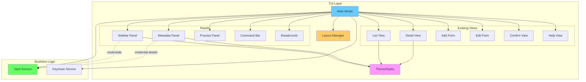
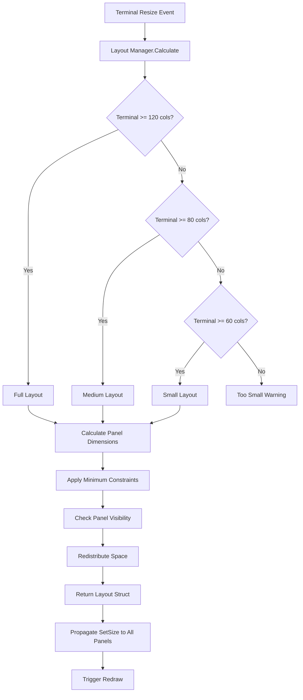

# Design Document: TUI Dashboard Layout

## Overview

The TUI Dashboard Layout transforms pass-cli's terminal user interface from a single-column, linear design into a modern, panel-based dashboard inspired by contemporary terminal applications like Superfile. The design introduces a **flexible panel system** with sidebar navigation, main content area, and metadata display, while maintaining the existing Bubble Tea architecture and VaultService integration.

**Key Design Principles**:
- **Panel-Based Architecture**: Independent, composable panels that can be shown/hidden dynamically
- **Responsive Layout Manager**: Centralized dimension calculation adapting to terminal size
- **Zero Breaking Changes**: Existing views (ListView, DetailView, Forms) become panel content without modification
- **Superfile-Inspired UX**: Modern aesthetics, toggle-able panels, vim-style commands, multi-pane support
- **Performance First**: Efficient rendering with minimal memory overhead

**Design Goals**:
1. Maximize information density without overwhelming users
2. Provide multiple navigation paradigms (tree, breadcrumbs, search, commands)
3. Adapt gracefully across terminal sizes (120+ columns to <80 columns)
4. Maintain 100% keyboard accessibility
5. Enable power-user workflows (multi-panel, command bar)

## Steering Document Alignment

### Technical Standards (tech.md)

**Language and Tooling**:
- Implementation in Go 1.25+ (matching existing codebase)
- Continues using Bubble Tea v0.25+ and Lipgloss v0.9+ (already in dependencies)
- No new external dependencies required
- Follows existing build system (Makefile, GoReleaser)

**Architecture Alignment**:
- **Layered Design**: Dashboard components sit within TUI layer, consuming same VaultService
- **Service Layer Reuse**: Zero changes to `internal/vault`, `internal/keychain`, `internal/storage`, `internal/crypto`
- **Component Modularity**: Each panel is isolated, testable component following single responsibility principle

**Performance Requirements**:
- Dashboard startup: <150ms (50ms increase acceptable for enhanced features)
- Panel focus switching: <16ms (60fps smooth transitions)
- Layout recalculation on resize: <50ms
- Memory overhead: <5MB additional (REQ: <50MB total from tech.md)

### Project Structure (structure.md)

**Directory Organization**:
```
pass-cli/
├── cmd/
│   └── tui/
│       ├── tui.go              # MODIFIED: Add dashboard mode toggle
│       ├── model.go            # MODIFIED: Add panel states, layout manager
│       ├── update.go           # MODIFIED: Add panel switching logic
│       ├── view.go             # MODIFIED: Render multi-panel layout
│       ├── keys.go             # MODIFIED: Add panel toggle keys
│       ├── messages.go         # MODIFIED: Add panel-related messages
│       ├── components/
│       │   ├── layout_manager.go      # NEW: Dimension calculations
│       │   ├── sidebar.go             # NEW: Category navigation panel
│       │   ├── breadcrumb.go          # NEW: Path indicator
│       │   ├── metadata_panel.go      # NEW: Details sidebar
│       │   ├── process_panel.go       # NEW: Operation feedback
│       │   ├── command_bar.go         # NEW: Vim-style commands
│       │   ├── statusbar.go           # EXISTS: Update with panel indicators
│       │   └── category_tree.go       # NEW: Hierarchical credential navigation
│       ├── views/
│       │   ├── list.go          # EXISTS: Becomes main panel content
│       │   ├── detail.go        # EXISTS: Becomes main panel content
│       │   ├── form_add.go      # EXISTS: Becomes main panel content
│       │   ├── form_edit.go     # EXISTS: Becomes main panel content
│       │   ├── confirm.go       # EXISTS: Overlay over panels
│       │   └── help.go          # EXISTS: Overlay over panels
│       └── styles/
│           └── theme.go         # MODIFIED: Add panel border styles, icons
```

**Naming Conventions** (following existing patterns):
- Panel files: `snake_case.go` (e.g., `layout_manager.go`, `sidebar.go`)
- Panel types: `PascalCase` (e.g., `LayoutManager`, `SidebarPanel`, `MetadataPanel`)
- Panel methods: `PascalCase` for public, `camelCase` for private

**Code Organization Principles**:
- Each panel component file handles one panel's logic and rendering
- LayoutManager is single source of truth for all dimension calculations
- Panels are stateless regarding other panels (communicate via Model state only)
- Theme extensions are centralized in `styles/theme.go`

## Code Reuse Analysis

### Existing Components to Leverage

**1. Bubble Tea Framework (Existing Dependency)**:
```go
// Core pattern continues unchanged:
type Model struct { ... }
func (m Model) Init() tea.Cmd { ... }
func (m Model) Update(msg tea.Msg) (tea.Model, tea.Cmd) { ... }
func (m Model) View() string { ... }

// Extended with panel state:
type Model struct {
    // ... existing fields ...

    // NEW: Panel system
    layoutManager    *LayoutManager
    sidebar          *SidebarPanel
    metadataPanel    *MetadataPanel
    processPanel     *ProcessPanel
    commandBar       *CommandBar

    // NEW: Panel state
    panelFocus       PanelFocus
    sidebarVisible   bool
    metadataVisible  bool
    processVisible   bool
    commandBarOpen   bool
}
```

**2. Existing Views (100% Reuse)**:
```go
// ALL existing views continue to work as main content:
- listView    *views.ListView      // Displays in main content panel
- detailView  *views.DetailView    // Displays in main content panel
- addForm     *views.AddFormView   // Displays in main content panel
- editForm    *views.EditFormView  // Displays in main content panel
- confirmView *views.ConfirmView   // Overlays entire dashboard
- helpView    *views.HelpView      // Overlays entire dashboard

// Views are unaware they're in panels - they receive dimensions via SetSize()
```

**3. VaultService (Zero Changes)**:
```go
// Dashboard uses same API as current TUI:
- vaultService.ListCredentialsWithMetadata() // For sidebar categories
- vaultService.GetCredential(service)         // For metadata panel
- vaultService.AddCredential(...)             // From forms
- vaultService.UpdateCredential(...)          // From forms
- vaultService.DeleteCredential(service)      // From confirmations

// NEW usage patterns (existing methods):
categories := categorizeCre credentials(vaultService.ListCredentialsWithMetadata())
// ^ Pure view-layer logic, no service changes
```

**4. Lipgloss Styling (Existing Dependency)**:
```go
// Extend existing theme with panel styles:
// styles/theme.go already has:
- BorderStyle, ModalBorderStyle (existing)
- PrimaryColor, SubtleColor (existing)
- TitleStyle, LabelStyle (existing)

// NEW additions to theme.go:
- ActivePanelBorderStyle   // Focused panel
- InactivePanelBorderStyle // Unfocused panel
- CategoryIcons            // Map[string]string for category icons
- StatusIcons              // Map[string]string for operation icons
```

**5. Window Size Handling (Existing Pattern)**:
```go
// Dashboard extends existing pattern:
case tea.WindowSizeMsg:
    m.width = msg.Width
    m.height = msg.Height

    // NEW: Calculate panel layouts
    layout := m.layoutManager.Calculate(m.width, m.height, m.getPanelStates())

    // Propagate to all components (existing pattern):
    if m.listView != nil {
        m.listView.SetSize(layout.Main.Width, layout.Main.Height)
    }
    if m.sidebar != nil {
        m.sidebar.SetSize(layout.Sidebar.Width, layout.Sidebar.Height)
    }
    // ... etc for all panels
```

### Integration Points

**Main Model Integration**:
```go
// cmd/tui/model.go - Extended Model structure:

type PanelFocus int

const (
    FocusSidebar PanelFocus = iota
    FocusMain
    FocusMetadata
    FocusCommandBar
)

type Model struct {
    // === EXISTING FIELDS (unchanged) ===
    state        AppState
    vaultService *vault.VaultService
    vaultPath    string
    credentials  []vault.CredentialMetadata
    listView     *views.ListView
    detailView   *views.DetailView
    addForm      *views.AddFormView
    editForm     *views.EditFormView
    confirmView  *views.ConfirmView
    helpView     *views.HelpView
    statusBar    *components.StatusBar
    keychainService *keychain.KeychainService
    previousState AppState
    width  int
    height int
    err    error
    errMsg string
    unlocking bool

    // === NEW FIELDS (dashboard) ===
    layoutManager    *LayoutManager
    sidebar          *SidebarPanel
    metadataPanel    *MetadataPanel
    processPanel     *ProcessPanel
    commandBar       *CommandBar
    breadcrumb       *Breadcrumb

    panelFocus       PanelFocus
    sidebarVisible   bool
    metadataVisible  bool
    processVisible   bool
    commandBarOpen   bool

    categories       []Category
    currentCategory  string
}
```

**Update Method Integration**:
```go
// cmd/tui/update.go - Extended update logic:

func (m Model) Update(msg tea.Msg) (tea.Model, tea.Cmd) {
    switch msg := msg.(type) {
    case tea.KeyMsg:
        // NEW: Panel toggle keys (higher priority)
        switch msg.String() {
        case "s":
            if !hasInputFocus(m) {
                m.sidebarVisible = !m.sidebarVisible
                return m, nil
            }
        case "m":
            if !hasInputFocus(m) && m.state == StateDetail {
                // Existing behavior: toggle password mask in detail view
            } else if !hasInputFocus(m) {
                // NEW: Toggle metadata panel
                m.metadataVisible = !m.metadataVisible
                return m, nil
            }
        case "p":
            if !hasInputFocus(m) {
                m.processVisible = !m.processVisible
                return m, nil
            }
        case "tab":
            if !hasInputFocus(m) && !m.commandBarOpen {
                m.panelFocus = nextPanelFocus(m.panelFocus, m.getPanelStates())
                return m, nil
            }
        case ":":
            if !hasInputFocus(m) {
                m.commandBarOpen = true
                m.commandBar.Focus()
                return m, nil
            }
        }

    case tea.WindowSizeMsg:
        // NEW: Layout recalculation
        m.width = msg.Width
        m.height = msg.Height

        layout := m.layoutManager.Calculate(
            m.width,
            m.height,
            m.getPanelStates(),
        )

        // Propagate sizes (existing + new panels)
        if m.sidebar != nil && m.sidebarVisible {
            m.sidebar.SetSize(layout.Sidebar.Width, layout.Sidebar.Height)
        }
        if m.listView != nil {
            m.listView.SetSize(layout.Main.Width, layout.Main.Height)
        }
        // ... etc

    // EXISTING message handlers continue unchanged
    case vaultUnlockedMsg:
        // ... existing logic
    case credentialsLoadedMsg:
        m.credentials = msg.credentials
        m.categories = categorizeCre credentials(msg.credentials) // NEW
        // ... existing logic
    }

    // Delegate to focused panel or active view (existing pattern)
    return m.updateActiveComponent(msg)
}
```

**View Method Integration**:
```go
// cmd/tui/view.go - Extended rendering:

func (m Model) View() string {
    // EXISTING: Overlays take full priority
    if m.state == StateHelp && m.helpView != nil {
        return m.helpView.View() // Overlay over everything
    }
    if m.state == StateConfirmDelete || m.state == StateConfirmDiscard {
        if m.confirmView != nil {
            return renderWithPanels(m, m.confirmView.View()) // Overlay over panels
        }
    }

    // NEW: Calculate layout
    layout := m.layoutManager.Calculate(m.width, m.height, m.getPanelStates())

    if layout.IsTooSmall {
        return renderMinimumSizeWarning(layout.MinWidth, layout.MinHeight)
    }

    // NEW: Render multi-panel layout
    var panels []string

    // Sidebar panel (if visible)
    if m.sidebarVisible && m.sidebar != nil {
        sidebarContent := m.sidebar.View()
        sidebarStyle := getPanel BorderStyle(m.panelFocus == FocusSidebar)
        panels = append(panels, sidebarStyle.
            Width(layout.Sidebar.Width).
            Height(layout.Sidebar.Height).
            Render(sidebarContent))
    }

    // Main content panel (always visible)
    mainContent := m.renderMainContent() // Returns existing view content
    mainStyle := getPanelBorderStyle(m.panelFocus == FocusMain)
    panels = append(panels, mainStyle.
        Width(layout.Main.Width).
        Height(layout.Main.Height).
        Render(mainContent))

    // Metadata panel (if visible)
    if m.metadataVisible && m.metadataPanel != nil {
        metadataContent := m.metadataPanel.View()
        metadataStyle := getPanelBorderStyle(m.panelFocus == FocusMetadata)
        panels = append(panels, metadataStyle.
            Width(layout.Metadata.Width).
            Height(layout.Metadata.Height).
            Render(metadataContent))
    }

    // Horizontal layout
    mainRow := lipgloss.JoinHorizontal(lipgloss.Top, panels...)

    // Process panel (bottom, if visible)
    if m.processVisible && m.processPanel != nil {
        processContent := m.processPanel.View()
        mainRow = lipgloss.JoinVertical(lipgloss.Left, mainRow, processContent)
    }

    // Command bar (bottom, if open)
    if m.commandBarOpen && m.commandBar != nil {
        commandContent := m.commandBar.View()
        mainRow = lipgloss.JoinVertical(lipgloss.Left, mainRow, commandContent)
    }

    // Status bar (always at bottom)
    if m.statusBar != nil {
        statusContent := m.statusBar.Render()
        mainRow = lipgloss.JoinVertical(lipgloss.Left, mainRow, statusContent)
    }

    return mainRow
}

func (m Model) renderMainContent() string {
    // EXISTING view rendering logic (unchanged):
    switch m.state {
    case StateList:
        if m.listView != nil {
            return m.listView.View()
        }
    case StateDetail:
        if m.detailView != nil {
            return m.detailView.View()
        }
    case StateAdd:
        if m.addForm != nil {
            return m.addForm.View()
        }
    // ... etc for all existing states
    }
    return "Loading..."
}
```

## Architecture

### System Architecture Diagram



### Layout Manager Flow



### Modular Design Principles

**Single File Responsibility**:
- `layout_manager.go`: Only dimension calculation logic
- `sidebar.go`: Only sidebar rendering and navigation
- `metadata_panel.go`: Only credential details display
- `command_bar.go`: Only command parsing and execution
- `category_tree.go`: Only categorization logic (pure functions)

**Component Isolation**:
- Panels don't communicate directly; all state flows through Model
- Each panel implements standard interface (SetSize, Update, View)
- Panels can be developed, tested, and debugged independently

**Service Layer Separation**:
- TUI layer (panels, views) handles presentation only
- VaultService handles all business logic (unchanged)
- No panel directly accesses storage, crypto, or keychain

## Components and Interfaces

### Component 1: LayoutManager

**File**: `cmd/tui/components/layout_manager.go`

**Purpose**: Centralized dimension calculation for all panels based on terminal size and visibility states

**Interface**:
```go
type LayoutManager struct {
    minWidth  int  // Minimum terminal width (60)
    minHeight int  // Minimum terminal height (20)
}

type PanelDimensions struct {
    X      int
    Y      int
    Width  int
    Height int
}

type Layout struct {
    Sidebar      PanelDimensions
    Main         PanelDimensions
    Metadata     PanelDimensions
    Process      PanelDimensions
    CommandBar   PanelDimensions
    StatusBar    PanelDimensions

    IsTooSmall   bool
    MinWidth     int
    MinHeight    int
}

type PanelStates struct {
    SidebarVisible   bool
    MetadataVisible  bool
    ProcessVisible   bool
    CommandBarOpen   bool
    MainPanelCount   int  // For multi-panel support
}

// Public API
func NewLayoutManager() *LayoutManager
func (lm *LayoutManager) Calculate(width, height int, states PanelStates) Layout
```

**Dependencies**: None (pure calculation logic)

**Reuses**: N/A (new component)

**Algorithm**:
```go
func (lm *LayoutManager) Calculate(width, height int, states PanelStates) Layout {
    layout := Layout{}

    // Check minimum size
    if width < lm.minWidth || height < lm.minHeight {
        layout.IsTooSmall = true
        layout.MinWidth = lm.minWidth
        layout.MinHeight = lm.minHeight
        return layout
    }

    // Determine breakpoint
    var breakpoint string
    if width >= 120 {
        breakpoint = "full"
    } else if width >= 80 {
        breakpoint = "medium"
    } else {
        breakpoint = "small"
    }

    // Calculate based on breakpoint and visibility
    switch breakpoint {
    case "full":
        return lm.calculateFullLayout(width, height, states)
    case "medium":
        return lm.calculateMediumLayout(width, height, states)
    case "small":
        return lm.calculateSmallLayout(width, height, states)
    }

    return layout
}

func (lm *LayoutManager) calculateFullLayout(width, height int, states PanelStates) Layout {
    layout := Layout{}

    // Reserve vertical space for fixed components
    availableHeight := height

    // Status bar (always 1 row)
    statusBarHeight := 1
    availableHeight -= statusBarHeight

    // Command bar (if open, 3 rows with border)
    if states.CommandBarOpen {
        commandBarHeight := 3
        availableHeight -= commandBarHeight
        layout.CommandBar = PanelDimensions{
            X:      0,
            Y:      height - statusBarHeight - commandBarHeight,
            Width:  width,
            Height: commandBarHeight,
        }
    }

    // Process panel (if visible, 5 rows)
    if states.ProcessVisible {
        processHeight := 5
        availableHeight -= processHeight
        layout.Process = PanelDimensions{
            X:      0,
            Y:      height - statusBarHeight - processHeight,
            Width:  width,
            Height: processHeight,
        }
    }

    // Horizontal space allocation for main panels
    availableWidth := width

    // Sidebar (if visible, 25% or 30 cols max)
    sidebarWidth := 0
    if states.SidebarVisible {
        sidebarWidth = width / 4  // 25%
        if sidebarWidth > 30 {
            sidebarWidth = 30
        }
        if sidebarWidth < 20 {
            sidebarWidth = 20  // Minimum
        }
        availableWidth -= sidebarWidth

        layout.Sidebar = PanelDimensions{
            X:      0,
            Y:      0,
            Width:  sidebarWidth,
            Height: availableHeight,
        }
    }

    // Metadata panel (if visible, 25% or 35 cols max)
    metadataWidth := 0
    if states.MetadataVisible {
        metadataWidth = width / 4  // 25%
        if metadataWidth > 35 {
            metadataWidth = 35
        }
        if metadataWidth < 25 {
            metadataWidth = 25  // Minimum
        }
        availableWidth -= metadataWidth

        layout.Metadata = PanelDimensions{
            X:      width - metadataWidth,
            Y:      0,
            Width:  metadataWidth,
            Height: availableHeight,
        }
    }

    // Main content (remaining space, split if multiple panels)
    mainWidth := availableWidth / states.MainPanelCount
    if mainWidth < 40 {
        mainWidth = 40  // Minimum for usability
    }

    mainX := sidebarWidth
    layout.Main = PanelDimensions{
        X:      mainX,
        Y:      0,
        Width:  mainWidth,
        Height: availableHeight,
    }

    // Status bar
    layout.StatusBar = PanelDimensions{
        X:      0,
        Y:      height - 1,
        Width:  width,
        Height: 1,
    }

    return layout
}
```

### Component 2: SidebarPanel

**File**: `cmd/tui/components/sidebar.go`

**Purpose**: Displays category tree, statistics, and quick actions for navigation

**Interface**:
```go
type Category struct {
    Name        string
    Icon        string
    Count       int
    Expanded    bool
    Credentials []vault.CredentialMetadata
}

type SidebarPanel struct {
    categories       []Category
    selectedCategory int
    selectedCred     int
    stats            Stats
    width            int
    height           int
    viewport         viewport.Model
}

type Stats struct {
    Total        int
    Used         int
    RecentlyMod  int
}

// Public API
func NewSidebarPanel(categories []Category, stats Stats) *SidebarPanel
func (sp *SidebarPanel) SetSize(width, height int)
func (sp *SidebarPanel) Update(msg tea.Msg) (*SidebarPanel, tea.Cmd)
func (sp *SidebarPanel) View() string
func (sp *SidebarPanel) GetSelectedCredential() *vault.CredentialMetadata
func (sp *SidebarPanel) GetSelectedCategory() string
```

**Dependencies**:
- `bubbles/viewport` for scrolling
- `cmd/tui/styles` for theming
- `internal/vault` for CredentialMetadata type

**Reuses**:
- Existing theme styles (TitleStyle, LabelStyle, etc.)
- Viewport pattern from DetailView

**Rendering Logic**:
```go
func (sp *SidebarPanel) View() string {
    var content strings.Builder

    // Header
    content.WriteString(styles.TitleStyle.Render("NAVIGATE"))
    content.WriteString("\n")
    content.WriteString(styles.SubtleStyle.Render("━━━━━━━━━━━━"))
    content.WriteString("\n\n")

    // Categories
    for i, cat := range sp.categories {
        isSelected := (i == sp.selectedCategory)

        // Category header
        icon := cat.Icon
        expandIcon := "▶"
        if cat.Expanded {
            expandIcon = "▼"
        }

        categoryLine := fmt.Sprintf("%s %s %s (%d)",
            expandIcon, icon, cat.Name, cat.Count)

        if isSelected {
            categoryLine = styles.SelectedStyle.Render(categoryLine)
        } else {
            categoryLine = styles.ValueStyle.Render(categoryLine)
        }

        content.WriteString(categoryLine)
        content.WriteString("\n")

        // Expanded credentials (indented)
        if cat.Expanded {
            for _, cred := range cat.Credentials {
                credLine := fmt.Sprintf("  %s %s",
                    getCategoryIcon(cat.Name), cred.Service)
                content.WriteString(styles.SubtleStyle.Render(credLine))
                content.WriteString("\n")
            }
        }
    }

    content.WriteString("\n")
    content.WriteString(styles.SubtleStyle.Render("━━━━━━━━━━━━"))
    content.WriteString("\n")

    // Stats
    content.WriteString(styles.TitleStyle.Render("📊 STATS"))
    content.WriteString("\n")
    content.WriteString(fmt.Sprintf("Total:   %d\n", sp.stats.Total))
    content.WriteString(fmt.Sprintf("Used:    %d\n", sp.stats.Used))
    content.WriteString(fmt.Sprintf("Recent:  %d\n", sp.stats.RecentlyMod))
    content.WriteString("\n")
    content.WriteString(styles.SubtleStyle.Render("━━━━━━━━━━━━"))
    content.WriteString("\n")

    // Quick actions
    content.WriteString(styles.TitleStyle.Render("⚡ QUICK"))
    content.WriteString("\n")
    content.WriteString(styles.KeyStyle.Render("[a]") + " Add\n")
    content.WriteString(styles.KeyStyle.Render("[:]") + " Command\n")
    content.WriteString(styles.KeyStyle.Render("[?]") + " Help\n")

    sp.viewport.SetContent(content.String())
    return sp.viewport.View()
}
```

### Component 3: MetadataPanel

**File**: `cmd/tui/components/metadata_panel.go`

**Purpose**: Displays selected credential details in right sidebar

**Interface**:
```go
type MetadataPanel struct {
    credential      *vault.Credential
    passwordMasked  bool
    width           int
    height          int
    viewport        viewport.Model
}

// Public API
func NewMetadataPanel() *MetadataPanel
func (mp *MetadataPanel) SetCredential(cred *vault.Credential)
func (mp *MetadataPanel) SetSize(width, height int)
func (mp *MetadataPanel) Update(msg tea.Msg) (*MetadataPanel, tea.Cmd)
func (mp *MetadataPanel) View() string
func (mp *MetadataPanel) TogglePasswordMask()
```

**Dependencies**:
- `bubbles/viewport` for scrolling
- `cmd/tui/styles` for theming
- `internal/vault` for Credential type

**Reuses**:
- DetailView's rendering logic (adapted for panel)
- Existing password masking logic

### Component 4: ProcessPanel

**File**: `cmd/tui/components/process_panel.go`

**Purpose**: Shows async operation feedback (password generation, save, delete)

**Interface**:
```go
type ProcessStatus int

const (
    ProcessPending ProcessStatus = iota
    ProcessRunning
    ProcessSuccess
    ProcessFailed
)

type Process struct {
    ID          string
    Description string
    Status      ProcessStatus
    Error       error
    Timestamp   time.Time
}

type ProcessPanel struct {
    processes   []Process
    maxDisplay  int  // Max 5 recent processes
    width       int
    height      int
}

// Public API
func NewProcessPanel() *ProcessPanel
func (pp *ProcessPanel) AddProcess(desc string) string  // Returns ID
func (pp *ProcessPanel) UpdateProcess(id string, status ProcessStatus, err error)
func (pp *ProcessPanel) SetSize(width, height int)
func (pp *ProcessPanel) View() string
```

**Dependencies**:
- `cmd/tui/styles` for theming

**Reuses**:
- Notification patterns from existing views

### Component 5: CommandBar

**File**: `cmd/tui/components/command_bar.go`

**Purpose**: Vim-style command execution (`:add`, `:search`, `:category`, etc.)

**Interface**:
```go
type CommandBar struct {
    input      textinput.Model
    history    []string
    historyIdx int
    error      string
    width      int
}

type Command struct {
    Name string
    Args []string
}

// Public API
func NewCommandBar() *CommandBar
func (cb *CommandBar) Focus()
func (cb *CommandBar) Blur()
func (cb *CommandBar) SetSize(width int)
func (cb *CommandBar) Update(msg tea.Msg) (*CommandBar, tea.Cmd)
func (cb *CommandBar) View() string
func (cb *CommandBar) GetCommand() *Command  // Returns parsed command on Enter
func (cb *CommandBar) SetError(err string)
```

**Dependencies**:
- `bubbles/textinput` for input field
- `cmd/tui/styles` for theming

**Reuses**:
- Existing input patterns from forms

**Command Parsing**:
```go
func parseCommand(input string) *Command {
    // Remove leading ':'
    input = strings.TrimPrefix(input, ":")
    input = strings.TrimSpace(input)

    parts := strings.Fields(input)
    if len(parts) == 0 {
        return nil
    }

    return &Command{
        Name: parts[0],
        Args: parts[1:],
    }
}

// Commands supported:
// :add [service]        -> Open add form, optionally pre-fill service
// :search [query]       -> Filter credentials
// :category [name]      -> Navigate to category
// :help, :h             -> Show help
// :quit, :q             -> Exit TUI
```

### Component 6: Breadcrumb

**File**: `cmd/tui/components/breadcrumb.go`

**Purpose**: Display navigation path (Home > APIs > Cloud > aws-prod)

**Interface**:
```go
type Breadcrumb struct {
    path   []string
    width  int
}

// Public API
func NewBreadcrumb() *Breadcrumb
func (bc *Breadcrumb) SetPath(segments ...string)
func (bc *Breadcrumb) SetSize(width int)
func (bc *Breadcrumb) View() string
```

**Dependencies**:
- `cmd/tui/styles` for theming
- `lipgloss` for truncation

**Reuses**:
- Existing text truncation patterns

### Component 7: CategoryTree (Pure Functions)

**File**: `cmd/tui/components/category_tree.go`

**Purpose**: Pure functions for categorizing credentials

**Interface**:
```go
// Public API
func CategorizeCredentials(creds []vault.CredentialMetadata) []Category
func GetCategoryIcon(categoryName string) string
func GetStatusIcon(status string) string

// Category detection patterns
var categoryPatterns = map[string][]string{
    "APIs & Services": {"api", "key", "openai", "anthropic", "cohere"},
    "Cloud Infrastructure": {"aws", "azure", "gcp", "digitalocean", "heroku", "linode", "vultr"},
    "Databases": {"postgres", "mysql", "mongodb", "redis", "sqlite", "mariadb"},
    "Version Control": {"github", "gitlab", "bitbucket", "git"},
    "Communication": {"sendgrid", "twilio", "mailgun", "slack", "discord"},
    "Payment Processing": {"stripe", "square", "paypal", "braintree"},
    "AI Services": {"openai", "anthropic", "cohere", "huggingface"},
}
```

**Dependencies**: None (pure functions)

**Reuses**: N/A (new utility)

## Data Models

### Category Model

```go
type Category struct {
    Name        string                      // "APIs & Services", "Cloud Infrastructure", etc.
    Icon        string                      // "🔑", "☁️", "💾", etc.
    Count       int                         // Number of credentials in category
    Expanded    bool                        // Tree expansion state
    Credentials []vault.CredentialMetadata  // Credentials in this category
}
```

### Layout Model

```go
type PanelDimensions struct {
    X      int  // X position (column)
    Y      int  // Y position (row)
    Width  int  // Panel width in columns
    Height int  // Panel height in rows
}

type Layout struct {
    Sidebar    PanelDimensions
    Main       PanelDimensions
    Metadata   PanelDimensions
    Process    PanelDimensions
    CommandBar PanelDimensions
    StatusBar  PanelDimensions

    IsTooSmall bool  // Terminal below minimum size
    MinWidth   int   // Required minimum width
    MinHeight  int   // Required minimum height
}
```

### Panel State Model

```go
type PanelStates struct {
    SidebarVisible   bool
    MetadataVisible  bool
    ProcessVisible   bool
    CommandBarOpen   bool
    MainPanelCount   int  // Number of credential panels (for multi-pane)
}

type PanelFocus int

const (
    FocusSidebar PanelFocus = iota
    FocusMain
    FocusMetadata
    FocusCommandBar
)
```

### Process Model

```go
type ProcessStatus int

const (
    ProcessPending ProcessStatus = iota
    ProcessRunning
    ProcessSuccess
    ProcessFailed
)

type Process struct {
    ID          string          // Unique identifier
    Description string          // "Generating password", "Saving credential", etc.
    Status      ProcessStatus   // Current status
    Error       error           // Error if failed
    Timestamp   time.Time       // When process started
}
```

## Error Handling

### Error Scenarios

1. **Terminal Too Small**
   - **Detection**: LayoutManager detects width < 60 or height < 20
   - **Handling**: Return layout with `IsTooSmall = true`
   - **User Impact**: Display centered warning overlay:
     ```
     ┌────────────────────────────────┐
     │  Terminal Too Small            │
     │                                │
     │  Current: 50x15                │
     │  Required: 60x20               │
     │                                │
     │  Please resize your terminal   │
     │  Press q to quit               │
     └────────────────────────────────┘
     ```

2. **Layout Calculation Failure**
   - **Detection**: Dimension calculation results in negative width/height
   - **Handling**: Fallback to single-panel mode (main content only)
   - **User Impact**: Sidebar and metadata hidden automatically, notification shown: "Layout adjusted for available space"

3. **Panel Content Overflow**
   - **Detection**: Content height/width exceeds allocated panel dimensions
   - **Handling**:
     - Use viewport with scrolling for vertical overflow
     - Truncate with ellipsis for horizontal overflow
   - **User Impact**: Scroll indicators appear, text truncated gracefully

4. **Invalid Command**
   - **Detection**: Command bar receives unknown command (e.g., `:foo`)
   - **Handling**: Set error message in CommandBar state
   - **User Impact**: Red error message displayed: "Unknown command: foo"

5. **Categorization Edge Cases**
   - **Detection**: Credential doesn't match any category pattern
   - **Handling**: Assign to "Uncategorized" category
   - **User Impact**: Appears in "📁 Uncategorized" category

6. **Multi-Panel Space Exhaustion**
   - **Detection**: User creates too many panels for available width
   - **Handling**: Limit panel creation when main width would be < 40 columns
   - **User Impact**: Notification: "Cannot create more panels. Close existing panels first."

7. **Font/Icon Not Supported**
   - **Detection**: Terminal doesn't support Unicode/nerd fonts
   - **Handling**: Graceful fallback to ASCII alternatives:
     - ☁️ → [C]
     - 🔑 → [K]
     - ▶ → >
     - ▼ → v
   - **User Impact**: Functional but less visually appealing (acceptable)

## Testing Strategy

### Unit Testing

**Layout Manager Tests** (`layout_manager_test.go`):
```go
func TestLayoutManager_FullLayout(t *testing.T) {
    lm := NewLayoutManager()
    states := PanelStates{
        SidebarVisible:  true,
        MetadataVisible: true,
        MainPanelCount:  1,
    }

    layout := lm.Calculate(140, 40, states)

    // Verify all panels have valid dimensions
    assert.Greater(t, layout.Sidebar.Width, 0)
    assert.Greater(t, layout.Main.Width, 0)
    assert.Greater(t, layout.Metadata.Width, 0)

    // Verify total width matches terminal
    totalWidth := layout.Sidebar.Width + layout.Main.Width + layout.Metadata.Width
    assert.Equal(t, 140, totalWidth)
}

func TestLayoutManager_TooSmallTerminal(t *testing.T) {
    lm := NewLayoutManager()
    layout := lm.Calculate(50, 15, PanelStates{})

    assert.True(t, layout.IsTooSmall)
    assert.Equal(t, 60, layout.MinWidth)
    assert.Equal(t, 20, layout.MinHeight)
}

func TestLayoutManager_ResponsiveBreakpoints(t *testing.T) {
    tests := []struct {
        width           int
        height          int
        sidebarVisible  bool
        metadataVisible bool
        expectSidebar   bool
        expectMetadata  bool
    }{
        {140, 40, true, true, true, true},      // Full layout
        {100, 30, true, true, true, false},     // Medium: metadata hidden
        {70, 25, true, true, false, false},     // Small: both hidden
    }

    for _, tt := range tests {
        t.Run(fmt.Sprintf("%dx%d", tt.width, tt.height), func(t *testing.T) {
            lm := NewLayoutManager()
            states := PanelStates{
                SidebarVisible:  tt.sidebarVisible,
                MetadataVisible: tt.metadataVisible,
                MainPanelCount:  1,
            }

            layout := lm.Calculate(tt.width, tt.height, states)

            if tt.expectSidebar {
                assert.Greater(t, layout.Sidebar.Width, 0)
            } else {
                assert.Equal(t, 0, layout.Sidebar.Width)
            }

            if tt.expectMetadata {
                assert.Greater(t, layout.Metadata.Width, 0)
            } else {
                assert.Equal(t, 0, layout.Metadata.Width)
            }
        })
    }
}
```

**Sidebar Panel Tests** (`sidebar_test.go`):
```go
func TestSidebarPanel_CategoryExpansion(t *testing.T) {
    categories := []Category{
        {Name: "APIs", Count: 5, Expanded: false},
        {Name: "Cloud", Count: 3, Expanded: false},
    }

    sidebar := NewSidebarPanel(categories, Stats{})

    // Expand first category
    sidebar.Update(tea.KeyMsg{Type: tea.KeyEnter})

    assert.True(t, sidebar.categories[0].Expanded)
    assert.False(t, sidebar.categories[1].Expanded)
}

func TestSidebarPanel_Navigation(t *testing.T) {
    sidebar := NewSidebarPanel(createTestCategories(), Stats{})

    // Navigate down
    sidebar.Update(tea.KeyMsg{Type: tea.KeyDown})
    assert.Equal(t, 1, sidebar.selectedCategory)

    // Navigate up
    sidebar.Update(tea.KeyMsg{Type: tea.KeyUp})
    assert.Equal(t, 0, sidebar.selectedCategory)
}
```

**Category Tree Tests** (`category_tree_test.go`):
```go
func TestCategorizeCredentials(t *testing.T) {
    creds := []vault.CredentialMetadata{
        {Service: "aws-prod", Username: "admin"},
        {Service: "github.com", Username: "user"},
        {Service: "postgres-db", Username: "dbuser"},
        {Service: "stripe-api", Username: ""},
        {Service: "random-service", Username: "user"},
    }

    categories := CategorizeCredentials(creds)

    // Verify categorization
    cloudCat := findCategory(categories, "Cloud Infrastructure")
    assert.Equal(t, 1, cloudCat.Count)
    assert.Equal(t, "aws-prod", cloudCat.Credentials[0].Service)

    gitCat := findCategory(categories, "Version Control")
    assert.Equal(t, 1, gitCat.Count)

    dbCat := findCategory(categories, "Databases")
    assert.Equal(t, 1, dbCat.Count)

    paymentCat := findCategory(categories, "Payment Processing")
    assert.Equal(t, 1, paymentCat.Count)

    uncatCat := findCategory(categories, "Uncategorized")
    assert.Equal(t, 1, uncatCat.Count)
}
```

**Command Bar Tests** (`command_bar_test.go`):
```go
func TestCommandBar_ParseCommand(t *testing.T) {
    tests := []struct {
        input    string
        expected *Command
    }{
        {":add github", &Command{Name: "add", Args: []string{"github"}}},
        {":search stripe", &Command{Name: "search", Args: []string{"stripe"}}},
        {":quit", &Command{Name: "quit", Args: []string{}}},
        {":category APIs", &Command{Name: "category", Args: []string{"APIs"}}},
    }

    for _, tt := range tests {
        t.Run(tt.input, func(t *testing.T) {
            cmd := parseCommand(tt.input)
            assert.Equal(t, tt.expected.Name, cmd.Name)
            assert.Equal(t, tt.expected.Args, cmd.Args)
        })
    }
}
```

### Integration Testing

**Dashboard Layout Integration** (`test/tui_dashboard_integration_test.go`):
```go
//go:build integration

func TestIntegration_DashboardPanelToggle(t *testing.T) {
    // Create test vault
    vaultPath := createTestVault(t)
    defer cleanupTestVault(t, vaultPath)

    // Initialize model with dashboard
    model, err := tui.NewModel(vaultPath)
    assert.NoError(t, err)

    // Set size
    model.Update(tea.WindowSizeMsg{Width: 140, Height: 40})

    // Initially sidebar should be visible
    assert.True(t, model.IsSidebarVisible())

    // Toggle sidebar
    model.Update(tea.KeyMsg{Type: tea.KeyRunes, Runes: []rune{'s'}})
    assert.False(t, model.IsSidebarVisible())

    // Toggle back
    model.Update(tea.KeyMsg{Type: tea.KeyRunes, Runes: []rune{'s'}})
    assert.True(t, model.IsSidebarVisible())
}

func TestIntegration_PanelFocusSwitching(t *testing.T) {
    model := createTestModelWithDashboard(t)

    // Initially focused on main
    assert.Equal(t, tui.FocusMain, model.GetPanelFocus())

    // Tab to metadata
    model.Update(tea.KeyMsg{Type: tea.KeyTab})
    assert.Equal(t, tui.FocusMetadata, model.GetPanelFocus())

    // Tab to sidebar
    model.Update(tea.KeyMsg{Type: tea.KeyTab})
    assert.Equal(t, tui.FocusSidebar, model.GetPanelFocus())
}

func TestIntegration_ResponsiveLayout(t *testing.T) {
    model := createTestModelWithDashboard(t)

    // Full size - all panels visible
    model.Update(tea.WindowSizeMsg{Width: 140, Height: 40})
    assert.True(t, model.IsSidebarVisible())
    assert.True(t, model.IsMetadataVisible())

    // Medium size - sidebar visible, metadata hidden
    model.Update(tea.WindowSizeMsg{Width: 100, Height: 30})
    assert.True(t, model.IsSidebarVisible())
    assert.False(t, model.IsMetadataVisible())

    // Small size - only main visible
    model.Update(tea.WindowSizeMsg{Width: 70, Height: 25})
    assert.False(t, model.IsSidebarVisible())
    assert.False(t, model.IsMetadataVisible())
}

func TestIntegration_CommandBarExecution(t *testing.T) {
    model := createTestModelWithDashboard(t)

    // Open command bar
    model.Update(tea.KeyMsg{Type: tea.KeyRunes, Runes: []rune{':'}})
    assert.True(t, model.IsCommandBarOpen())

    // Type command
    model.Update(tea.KeyMsg{Type: tea.KeyRunes, Runes: []rune{'s'}})
    model.Update(tea.KeyMsg{Type: tea.KeyRunes, Runes: []rune{'e'}})
    model.Update(tea.KeyMsg{Type: tea.KeyRunes, Runes: []rune{'a'}})
    model.Update(tea.KeyMsg{Type: tea.KeyRunes, Runes: []rune{'r'}})
    model.Update(tea.KeyMsg{Type: tea.KeyRunes, Runes: []rune{'c'}})
    model.Update(tea.KeyMsg{Type: tea.KeyRunes, Runes: []rune{'h'}})
    model.Update(tea.KeyMsg{Type: tea.KeySpace})
    model.Update(tea.KeyMsg{Type: tea.KeyRunes, Runes: []rune{'a'}})
    model.Update(tea.KeyMsg{Type: tea.KeyRunes, Runes: []rune{'w'}})
    model.Update(tea.KeyMsg{Type: tea.KeyRunes, Runes: []rune{'s'}})

    // Execute
    model.Update(tea.KeyMsg{Type: tea.KeyEnter})

    // Verify search activated
    assert.True(t, model.IsSearchActive())
    assert.Equal(t, "aws", model.GetSearchQuery())
}
```

### End-to-End Testing

**Manual Testing Checklist**:
- [ ] Full layout (140x40) displays all three panels correctly
- [ ] Medium layout (100x30) hides metadata panel
- [ ] Small layout (70x25) hides sidebar and metadata
- [ ] Too-small warning appears below 60x20
- [ ] Panel toggle keys (s/m/p/f) work correctly
- [ ] Tab switches focus between visible panels
- [ ] Sidebar category expansion/collapse works
- [ ] Command bar opens with `:` and executes commands
- [ ] Process panel shows async operation feedback
- [ ] Breadcrumb updates when navigating
- [ ] Metadata panel displays credential details
- [ ] All existing TUI features work in panels (add/edit/delete/search)
- [ ] Icons display correctly (or fallback gracefully)
- [ ] Cross-platform: Windows Terminal, macOS Terminal, Linux terminals

**Performance Testing**:
- [ ] Dashboard launches in <150ms
- [ ] Panel switching is smooth (no visible lag)
- [ ] Resize recalculation completes in <50ms
- [ ] Memory usage increase is <5MB
- [ ] Large vaults (1000+ credentials) render without lag
