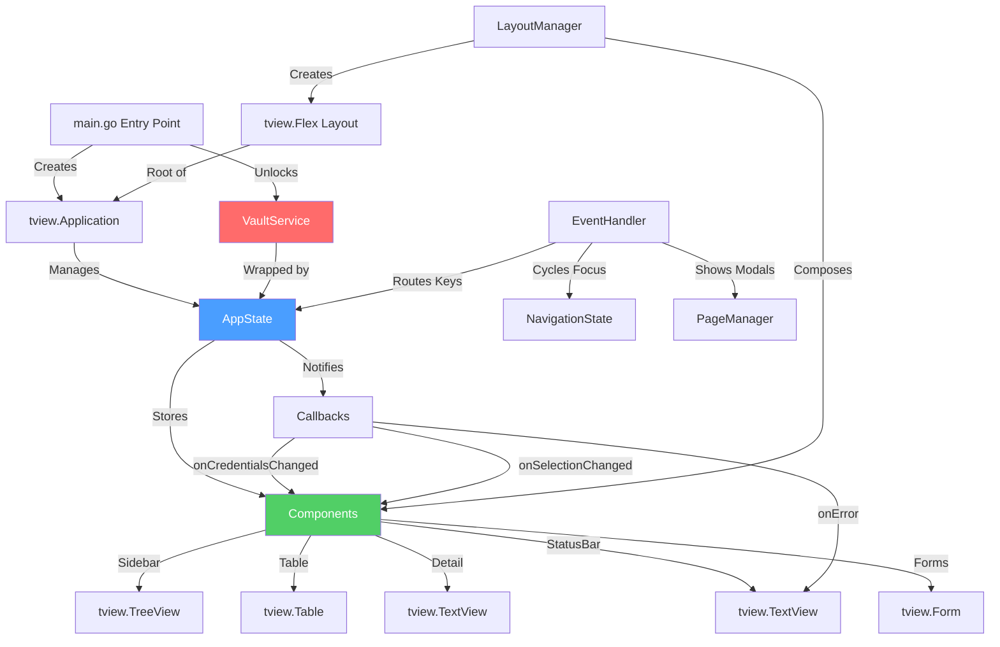
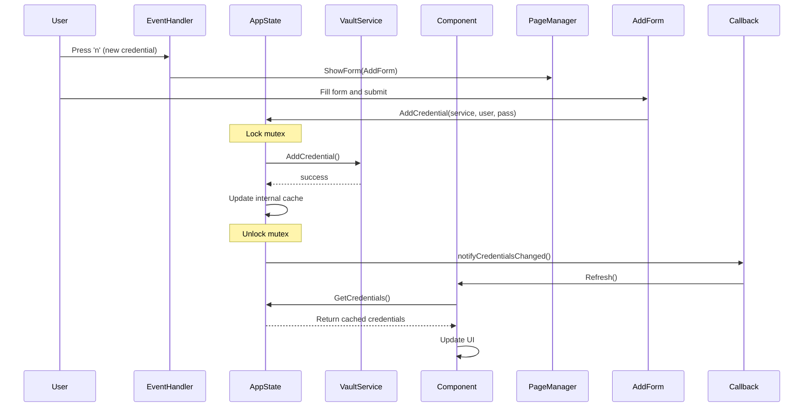

# Design Document

## Overview

The tui-tview-implementation converts comprehensive architectural documentation from `cmd/tui-tview-skeleton/` into a production-ready tview-based Terminal User Interface. The design follows a clean, modular architecture with strict separation between state management, UI components, layout logic, and event handling.

This implementation creates a modern, widget-based TUI using rivo/tview framework in a NEW directory (`cmd/tui-tview/`) alongside the existing Bubble Tea implementation (`cmd/tui/`). The design prevents mutex deadlocks, eliminates duplicate component instances, and provides responsive layout adaptation based on terminal size.

**Key Architecture Principle**: Single source of truth (AppState) → Components read from state → Layout composes components → Events modify state.

## Scope Boundary (CRITICAL)

**This spec builds a NEW implementation, not a modification of existing code.**

**Directory boundaries:**
- ✅ **Work in**: `cmd/tui-tview/` - New tview implementation (this spec)
- ❌ **Do NOT touch**: `cmd/tui/` - Existing Bubble Tea implementation (preserved)
- ✅ **Reference**: `cmd/tui-tview-skeleton/` - Architectural documentation

**Integration boundaries:**
- ✅ **Reuse**: `internal/vault`, `internal/keychain`, `internal/crypto` (existing services)
- ✅ **Reuse**: External dependencies (tview, tcell, clipboard, etc.)
- ❌ **Do NOT reference**: `cmd/tui/components/`, `cmd/tui/views/` (Bubble Tea code)

The old Bubble Tea implementation remains functional and is NOT being migrated in this spec. Removal is a separate future task.

## Steering Document Alignment

### Technical Standards (tech.md)

**Framework Alignment**:
- Uses **github.com/rivo/tview v0.42.0** for widget-based UI (documented in tech.md as "actively used for migration")
- Uses **github.com/gdamore/tcell/v2 v2.9.0** for terminal control (existing dependency)
- Integrates with **github.com/howeyc/gopass** for masked password input (existing)
- Reuses **internal/vault** package for credential operations (no duplication)
- Reuses **internal/keychain** package for system keychain integration (existing)

**Architecture Layer Integration**:
- **TUI Layer**: New tview implementation in `cmd/tui-tview/` alongside existing Bubble Tea in `cmd/tui/`
- **Service Layer**: Reuses existing `internal/vault/vault.go` VaultService with zero modifications
- **Crypto Layer**: No changes needed (vault service handles all encryption)
- **Keychain Layer**: Reuses existing `internal/keychain` for automatic unlock

**Build and Quality**:
- Go 1.25.1 compatible (uses standard library and approved dependencies)
- CGO disabled (tview is pure Go)
- Cross-platform (tview works on Windows, macOS, Linux)
- Follows existing code quality standards (gofmt, golangci-lint, gosec)

### Project Structure (structure.md)

**Directory Organization**:
```
cmd/
├── tui/                    # Existing Bubble Tea implementation (preserved)
└── tui-tview/             # New tview implementation (this spec)
    ├── main.go            # Entry point
    ├── app.go             # Application lifecycle
    ├── models/
    │   ├── state.go       # AppState with deadlock prevention
    │   └── navigation.go  # Navigation and focus state
    ├── components/
    │   ├── sidebar.go     # Category tree (tview.TreeView)
    │   ├── table.go       # Credential list (tview.Table)
    │   ├── detail.go      # Credential details (tview.TextView)
    │   ├── statusbar.go   # Status bar (tview.TextView)
    │   └── forms.go       # Add/Edit forms (tview.Form + Modal)
    ├── layout/
    │   ├── manager.go     # Responsive layout (tview.Flex)
    │   └── pages.go       # Modal management (tview.Pages)
    ├── events/
    │   ├── handlers.go    # Global keyboard shortcuts
    │   └── focus.go       # Focus management
    └── styles/
        └── theme.go       # Colors and styling (tcell.Color)
```

**Naming Conventions**:
- Files: `snake_case.go` (sidebar.go, layout_manager.go)
- Tests: `*_test.go` (state_test.go, sidebar_test.go)
- Packages: lowercase single word (models, components, layout, events, styles)
- Types: PascalCase (AppState, Sidebar, LayoutManager)
- Functions: PascalCase for exported, camelCase for private

**Import Order**:
1. Standard library (fmt, os, sync)
2. External dependencies (github.com/rivo/tview, github.com/gdamore/tcell/v2)
3. Internal packages (pass-cli/internal/vault, pass-cli/cmd/tui-tview/models)

## Code Reuse Analysis

### Existing Components to Leverage

**1. VaultService (internal/vault/vault.go)**
- **What**: Complete credential management with encryption, keychain, usage tracking
- **How Used**: AppState wraps VaultService, provides thread-safe access
- **Methods Used**:
  - `New()` - Create vault service instance
  - `UnlockWithKeychain()` - Attempt automatic unlock
  - `Unlock(password)` - Manual unlock with password
  - `ListCredentials()` - Get all credentials
  - `AddCredential(service, username, password, category)` - Add new credential
  - `UpdateCredential(id, service, username, password, category)` - Update existing
  - `DeleteCredential(id)` - Delete credential
  - `GetCredential(id)` - Get specific credential

**2. Keychain Service (internal/keychain/keychain.go)**
- **What**: System keychain integration (Windows Credential Manager, macOS Keychain, Linux Secret Service)
- **How Used**: Called via VaultService.UnlockWithKeychain() in main.go entry point
- **Integration**: No direct TUI interaction, handled in initialization

**3. Password Input (github.com/howeyc/gopass)**
- **What**: Masked password input for terminal
- **How Used**: In main.go for master password prompt fallback
- **Integration**: Pre-TUI initialization, not within tview application

**4. Clipboard Integration (github.com/atotto/clipboard)**
- **What**: Cross-platform clipboard operations
- **How Used**: In detail view component for copying passwords
- **Methods**: `clipboard.WriteAll(password)` for copy operation

**5. Existing Styles Pattern (cmd/tui/styles/theme.go)**
- **What**: Color palette definitions using Lipgloss
- **How Adapted**: Convert color definitions to tcell.NewRGBColor() format
- **Colors Reused**: Accent colors, border colors, background colors (consistent visual identity)

### Integration Points

**Vault Service Integration**:
- **Location**: models/state.go wraps VaultService
- **Pattern**: State holds reference, all vault operations go through state
- **Thread Safety**: AppState provides RWMutex protection around vault calls
- **Notification**: State notifies components after vault modifications

**CLI Command Integration**:
- **Location**: cmd/root.go registers new `tui` command
- **Pattern**: Similar to existing CLI commands, but launches TUI instead of printing output
- **Entry Point**: `cmd/tui-tview/main.go` exported as `LaunchTUI()`
- **Vault Sharing**: Same vault file as CLI commands (~/.pass-cli/vault.enc)

**Component Isolation**:
- **No Shared State**: TUI components don't share state with CLI commands
- **Separate Execution**: TUI runs as standalone mode (user exits CLI to enter TUI)
- **Data Consistency**: Both use same vault file, changes visible across modes

## Architecture

### Modular Design Principles

**Single File Responsibility**:
- `main.go`: Entry point, vault unlocking, TUI initialization
- `app.go`: tview.Application lifecycle and panic recovery
- `models/state.go`: Central state management with deadlock prevention
- `models/navigation.go`: Focus and navigation state
- Each component file handles one UI element (sidebar.go, table.go, detail.go, etc.)

**Component Isolation**:
- Components are **wrappers around tview primitives** (Sidebar wraps TreeView)
- Components **read from AppState**, never modify other components directly
- Components provide **Refresh()** method to update from current state
- No component holds duplicate state (single source of truth in AppState)

**Service Layer Separation**:
- **Presentation Layer**: TUI components (views, layout)
- **State Layer**: AppState (business logic coordination)
- **Service Layer**: VaultService (data access and encryption)
- **Clean boundaries**: Presentation → State → Service (never skipping layers)

**Utility Modularity**:
- `styles/theme.go`: Color definitions and styling utilities
- `layout/manager.go`: Responsive layout calculations
- `layout/pages.go`: Modal and page management
- `events/handlers.go`: Keyboard shortcut routing
- `events/focus.go`: Focus cycling logic

### Architecture Diagram



### Data Flow Diagram



### Deadlock Prevention Architecture

**The Problem** (from previous implementations):
```go
// ❌ WRONG: Deadlock risk
func (s *AppState) Update() {
    s.mu.Lock()
    defer s.mu.Unlock()  // Lock held until return

    s.data = newData
    s.callback()  // ❌ Called while locked! Deadlock if callback tries to read state
}
```

**The Solution** (this implementation):
```go
// ✅ CORRECT: Lock → Mutate → Unlock → Notify
func (s *AppState) Update() {
    s.mu.Lock()
    s.data = newData
    s.mu.Unlock()  // ✅ Release FIRST

    s.notifyChanged()  // ✅ Notify AFTER unlock
}
```

**Enforcement Pattern**:
1. **Write operations**: Never use `defer` for write locks
2. **Explicit unlock**: Unlock before calling any callback
3. **Notification helpers**: Private methods for notifications (always called after unlock)
4. **Read operations**: Can use `defer` (simple getters)

## Components and Interfaces

### Component 1: AppState (models/state.go)

**Purpose**: Central application state with thread-safe access to vault data and UI state

**Interfaces**:
```go
// State creation
NewAppState(vaultService *vault.VaultService) *AppState

// Data access (read operations - use RLock)
GetCredentials() []vault.Credential
GetCategories() []string
GetSelectedCategory() string
GetSelectedCredential() *vault.Credential

// Data mutations (write operations - explicit unlock before notify)
LoadCredentials() error
AddCredential(service, username, password, category string) error
UpdateCredential(id, service, username, password, category string) error
DeleteCredential(id string) error

// Selection management
SetSelectedCategory(category string)
SetSelectedCredential(credential *vault.Credential)

// Component management
SetSidebar(sidebar *tview.TreeView)
GetSidebar() *tview.TreeView
SetTable(table *tview.Table)
GetTable() *tview.Table
SetDetailView(view *tview.TextView)
GetDetailView() *tview.TextView
SetStatusBar(bar *tview.TextView)
GetStatusBar() *tview.TextView

// Notification registration
SetOnCredentialsChanged(callback func())
SetOnSelectionChanged(callback func())
SetOnError(callback func(error))
```

**Dependencies**:
- `internal/vault.VaultService` (wrapped instance)
- `sync.RWMutex` (concurrency control)
- `github.com/rivo/tview` (component types)

**Reuses**: Existing VaultService with zero modifications

**Critical Pattern**:
```go
type AppState struct {
    mu sync.RWMutex  // Protects all fields

    vault *vault.VaultService
    credentials []vault.Credential
    categories []string

    selectedCategory string
    selectedCredential *vault.Credential

    // Single instance components
    sidebar *tview.TreeView
    table *tview.Table
    detailView *tview.TextView
    statusBar *tview.TextView

    // Callbacks (called AFTER unlock)
    onCredentialsChanged func()
    onSelectionChanged func()
    onError func(error)
}
```

### Component 2: Sidebar (components/sidebar.go)

**Purpose**: Category tree navigation using tview.TreeView

**Interfaces**:
```go
// Creation
NewSidebar(appState *models.AppState) *Sidebar

// UI updates
Refresh()  // Rebuild tree from current state

// Internal (not exported)
onSelect(node *tview.TreeNode)  // Selection handler
applyStyles()  // Apply theme colors
buildTree(categories []string)  // Construct tree nodes
```

**Structure**:
```go
type Sidebar struct {
    *tview.TreeView  // Embedded TreeView

    appState *models.AppState  // State reference
    rootNode *tview.TreeNode   // Tree root
}
```

**Dependencies**:
- `models.AppState` (reads categories, sets selected category)
- `github.com/rivo/tview.TreeView` (primitive)
- `styles.Theme` (colors)

**Reuses**:
- AppState for data access
- Theme colors from styles/theme.go

**Tree Structure**:
```
All Credentials (root)
├── AWS
├── GitHub
├── Databases
└── Uncategorized
```

### Component 3: Table (components/table.go)

**Purpose**: Credential list display using tview.Table

**Interfaces**:
```go
// Creation
NewTable(appState *models.AppState) *Table

// UI updates
Refresh()  // Rebuild table from current state

// Internal
onSelect(row, col int)  // Selection handler
applyStyles()  // Apply theme
```

**Structure**:
```go
type Table struct {
    *tview.Table  // Embedded Table

    appState *models.AppState
    filteredCredentials []vault.Credential  // Current view
}
```

**Dependencies**:
- `models.AppState` (reads credentials, sets selected credential)
- `github.com/rivo/tview.Table`
- `styles.Theme`

**Reuses**: AppState for filtered credential list

**Table Layout**:
```
| Service  | Username       | Category | Last Used |
|----------|----------------|----------|-----------|
| AWS Prod | admin          | AWS      | 2h ago    |
| GitHub   | myuser         | GitHub   | 1d ago    |
```

### Component 4: DetailView (components/detail.go)

**Purpose**: Credential details display using tview.TextView

**Interfaces**:
```go
// Creation
NewDetailView(appState *models.AppState) *DetailView

// UI updates
Refresh()  // Rebuild from selected credential

// Actions
TogglePasswordVisibility()
CopyPasswordToClipboard() error

// Internal
formatCredential(cred *vault.Credential) string
```

**Structure**:
```go
type DetailView struct {
    *tview.TextView

    appState *models.AppState
    passwordVisible bool  // Toggle state
}
```

**Dependencies**:
- `models.AppState` (reads selected credential)
- `github.com/rivo/tview.TextView`
- `github.com/atotto/clipboard` (copy password)
- `styles.Theme`

**Reuses**: Existing clipboard library

### Component 5: StatusBar (components/statusbar.go)

**Purpose**: Context-aware keyboard shortcuts display

**Interfaces**:
```go
// Creation
NewStatusBar(appState *models.AppState) *StatusBar

// UI updates
UpdateForContext(focus FocusContext)
ShowSuccess(message string)
ShowError(err error)

// Internal
getShortcutsForContext(focus FocusContext) string
```

**Structure**:
```go
type StatusBar struct {
    *tview.TextView

    appState *models.AppState
}

type FocusContext int
const (
    FocusSidebar FocusContext = iota
    FocusTable
    FocusDetail
    FocusModal
)
```

**Dependencies**:
- `models.AppState`
- `github.com/rivo/tview.TextView`
- `styles.Theme`

**Display Examples**:
```
Table focused: [n] New  [e] Edit  [d] Delete  [c] Copy  [?] Help  [q] Quit
Detail focused: [e] Edit  [d] Delete  [p] Toggle  [c] Copy  [?] Help  [q] Quit
Modal open: [Esc] Close  [Enter] Submit
```

### Component 6: Forms (components/forms.go)

**Purpose**: Add and edit credential forms using tview.Form

**Interfaces**:
```go
// Add form
NewAddForm(appState *models.AppState) *AddForm
SetOnSubmit(callback func())
SetOnCancel(callback func())

// Edit form
NewEditForm(appState *models.AppState, credential *vault.Credential) *EditForm
SetOnSubmit(callback func())
SetOnCancel(callback func())
```

**Structure**:
```go
type AddForm struct {
    *tview.Form

    appState *models.AppState

    onSubmit func()
    onCancel func()
}

type EditForm struct {
    *tview.Form

    appState *models.AppState
    credential *vault.Credential

    onSubmit func()
    onCancel func()
}
```

**Dependencies**:
- `models.AppState` (calls AddCredential/UpdateCredential)
- `github.com/rivo/tview.Form`
- `styles.Theme`

**Reuses**: AppState vault operations

### Component 7: LayoutManager (layout/manager.go)

**Purpose**: Responsive layout with breakpoint-based adaptation

**Interfaces**:
```go
// Creation
NewLayoutManager(app *tview.Application, appState *models.AppState) *LayoutManager

// Layout building
CreateMainLayout() *tview.Flex

// Resize handling
HandleResize(width, height int)
GetCurrentMode() LayoutMode

// Configuration
SetBreakpoints(medium, large int)

// Internal
rebuildLayout()
determineLayoutMode(width int) LayoutMode
```

**Structure**:
```go
type LayoutMode int
const (
    LayoutSmall  LayoutMode = iota  // < 80 cols
    LayoutMedium                     // 80-120 cols
    LayoutLarge                      // > 120 cols
)

type LayoutManager struct {
    app *tview.Application
    appState *models.AppState

    width, height int
    currentMode LayoutMode

    mainLayout *tview.Flex
    contentRow *tview.Flex

    // Component references
    sidebar, table, detailView, statusBar tview.Primitive

    // Breakpoints
    mediumBreakpoint int  // 80
    largeBreakpoint int   // 120
}
```

**Dependencies**:
- `models.AppState` (gets component references)
- `github.com/rivo/tview` (Flex layout)
- `github.com/gdamore/tcell/v2` (screen size)

**Reuses**: Single instance components from AppState

### Component 8: PageManager (layout/pages.go)

**Purpose**: Modal and page management using tview.Pages

**Interfaces**:
```go
// Creation
NewPageManager(app *tview.Application) *PageManager

// Modal management
ShowModal(name string, modal tview.Primitive, width, height int)
ShowForm(form *tview.Form, title string)
ShowConfirmDialog(title, message string, onYes, onNo func())
CloseModal(name string)
CloseTopModal()
HasModals() bool

// Page management
ShowPage(name string, primitive tview.Primitive)
SwitchToPage(name string)
```

**Structure**:
```go
type PageManager struct {
    *tview.Pages

    app *tview.Application
    modalStack []string  // Track modal order
}
```

**Dependencies**:
- `github.com/rivo/tview.Pages`
- `github.com/rivo/tview` (Modal, Form)

**Reuses**: tview's built-in modal system

### Component 9: EventHandler (events/handlers.go)

**Purpose**: Global keyboard shortcuts with input protection

**Interfaces**:
```go
// Creation
NewEventHandler(app, appState, nav, pageManager, statusBar) *EventHandler

// Setup
SetupGlobalShortcuts()

// Internal action handlers
handleQuit()
handleNewCredential()
handleEditCredential()
handleDeleteCredential()
handleTogglePassword()
handleCopyPassword()
handleShowHelp()
handleTabFocus()
handleShiftTabFocus()
```

**Structure**:
```go
type EventHandler struct {
    app *tview.Application
    appState *models.AppState
    nav *models.NavigationState
    pageManager *layout.PageManager
    statusBar *components.StatusBar
}
```

**Dependencies**:
- All major components (orchestrates interactions)
- `github.com/gdamore/tcell/v2` (keyboard events)

**Critical Pattern** (Input Protection):
```go
func (eh *EventHandler) SetupGlobalShortcuts() {
    eh.app.SetInputCapture(func(event *tcell.EventKey) *tcell.EventKey {
        // ✅ CRITICAL: Protect input components
        focused := eh.app.GetFocus()
        if focused != nil {
            switch focused.(type) {
            case *tview.Form, *tview.InputField, *tview.TextArea:
                if event.Key() == tcell.KeyCtrlC {
                    eh.handleQuit()
                    return nil
                }
                return event  // Let input handle its keys
            }
        }

        // Handle shortcuts only for non-input components
        return eh.handleGlobalKey(event)
    })
}
```

### Component 10: NavigationState (models/navigation.go)

**Purpose**: Focus management and cycling

**Interfaces**:
```go
// Creation
NewNavigationState(app *tview.Application, appState *models.AppState) *NavigationState

// Focus management
CycleFocus()
CycleFocusReverse()
SetFocus(component FocusTarget)
GetCurrentFocus() FocusTarget

// Configuration
SetFocusOrder(order []tview.Primitive)
```

**Structure**:
```go
type FocusTarget int
const (
    FocusSidebar FocusTarget = iota
    FocusTable
    FocusDetail
)

type NavigationState struct {
    app *tview.Application
    appState *models.AppState

    focusOrder []tview.Primitive
    currentIndex int
}
```

**Dependencies**:
- `models.AppState` (gets component references)
- `tview.Application` (sets focus)

**Reuses**: AppState component references

## Data Models

### AppState Internal Models

```go
// Central state (lives in memory only)
type AppState struct {
    mu sync.RWMutex

    // Vault service (persists to disk)
    vault *vault.VaultService

    // Cached data (synced from vault)
    credentials []vault.Credential  // All credentials
    categories []string              // Unique categories

    // UI state (ephemeral)
    selectedCategory string
    selectedCredential *vault.Credential

    // Component references (created once, reused)
    sidebar *tview.TreeView
    table *tview.Table
    detailView *tview.TextView
    statusBar *tview.TextView

    // Callbacks
    onCredentialsChanged func()
    onSelectionChanged func()
    onError func(error)
}
```

### Vault Models (Existing)

```go
// From internal/vault/vault.go (already exists, no changes needed)

type Credential struct {
    ID string
    Service string
    Username string
    Password string
    Category string
    URL string
    Notes string
    CreatedAt time.Time
    ModifiedAt time.Time
    UsageRecords []UsageRecord
}

type UsageRecord struct {
    Timestamp time.Time
    Location string
    GitRepo string
}

type VaultService struct {
    // Internal fields (private)
    // All operations go through public methods
}
```

### Layout Models

```go
type LayoutMode int
const (
    LayoutSmall  LayoutMode = iota  // Table only
    LayoutMedium                     // Sidebar + Table
    LayoutLarge                      // Sidebar + Table + Detail
)

type FocusContext int
const (
    FocusSidebar FocusContext = iota
    FocusTable
    FocusDetail
    FocusModal
)
```

## Error Handling

### Error Scenarios

1. **Vault Unlock Failure**
   - **Handling**: Try keychain, fallback to password prompt (3 attempts), exit on failure
   - **User Impact**: Displays "Unlock failed: <reason>" and exits with code 1

2. **Credential Load Failure**
   - **Handling**: AppState.LoadCredentials() returns error, triggers onError callback
   - **User Impact**: Shows error modal "Failed to load credentials: <reason>", allows retry

3. **Credential Add/Update/Delete Failure**
   - **Handling**: Vault operation fails, AppState returns error, triggers onError callback
   - **User Impact**: Shows error modal, form stays open for correction

4. **Component Refresh Failure**
   - **Handling**: Component.Refresh() catches panics, logs error, displays empty state
   - **User Impact**: Component shows "No data available" or last known state

5. **Terminal Resize Failure**
   - **Handling**: Layout rebuild is best-effort, falls back to previous layout if fails
   - **User Impact**: Layout may not adjust until next successful resize

6. **Clipboard Copy Failure**
   - **Handling**: clipboard.WriteAll() returns error, displayed in status bar
   - **User Impact**: Status bar shows "Failed to copy to clipboard"

7. **Application Panic**
   - **Handling**: Panic recovery in main.go and app.go restores terminal state
   - **User Impact**: Terminal restored, error message shown, exit code 1

### Error Propagation Pattern

```go
// 1. Vault operation fails
err := vaultService.AddCredential(...)
if err != nil {
    return fmt.Errorf("vault operation failed: %w", err)
}

// 2. AppState propagates error
func (s *AppState) AddCredential(...) error {
    s.mu.Lock()
    err := s.vault.AddCredential(...)
    s.mu.Unlock()

    if err != nil {
        s.notifyError(err)  // Notify after unlock
        return err
    }

    s.notifyCredentialsChanged()
    return nil
}

// 3. Component/EventHandler handles error
err := appState.AddCredential(...)
if err != nil {
    statusBar.ShowError(err)  // Display to user
    // Keep form open for correction
}
```

## Testing Strategy

### Unit Testing

**State Management Tests** (models/state_test.go):
- Test LoadCredentials with mock vault service
- Test Add/Update/Delete operations
- Test callback invocation after unlock
- Test concurrent access with goroutines (verify no deadlocks)
- Test component storage/retrieval

**Component Tests** (components/*_test.go):
- Test Sidebar.Refresh() rebuilds tree correctly
- Test Table.Refresh() updates rows
- Test DetailView formatting
- Test StatusBar context switching
- Test Form validation

**Layout Tests** (layout/manager_test.go):
- Test determineLayoutMode() for each breakpoint
- Test rebuildLayout() for each mode
- Test component visibility at each breakpoint

**Event Tests** (events/handlers_test.go):
- Test input protection (verify Form input not intercepted)
- Test shortcut routing
- Test focus cycling

**Example Test**:
```go
func TestAppState_AddCredential_NotifiesAfterUnlock(t *testing.T) {
    mockVault := &MockVaultService{}
    state := NewAppState(mockVault)

    notified := false
    state.SetOnCredentialsChanged(func() {
        notified = true
    })

    err := state.AddCredential("test", "user", "pass", "cat")
    assert.NoError(t, err)
    assert.True(t, notified, "Should notify after unlock")
}
```

### Integration Testing

**TUI Integration Tests** (test/tui_integration_test.go):
- Test vault unlock → load credentials → display dashboard
- Test add credential flow (open form → submit → verify in table)
- Test edit credential flow
- Test delete confirmation flow
- Test keyboard navigation (Tab cycles focus)

**Mock Strategy**:
- Mock VaultService for predictable test data
- Mock tcell.Screen for simulating terminal events
- Use tview's test helpers for component testing

**Example**:
```go
func TestTUI_AddCredentialFlow(t *testing.T) {
    app, state := setupTestTUI(t)

    // Simulate pressing 'n'
    simulateKey(app, 'n')

    // Verify form is shown
    assert.True(t, pageManager.HasModals())

    // Fill and submit form
    fillForm(app, "AWS", "admin", "password123")
    simulateKey(app, tcell.KeyEnter)

    // Verify credential added
    creds := state.GetCredentials()
    assert.Len(t, creds, 1)
    assert.Equal(t, "AWS", creds[0].Service)
}
```

### End-to-End Testing

**Manual Testing Checklist**:
1. Launch TUI with keychain unlock
2. Launch TUI with password prompt
3. Navigate categories with arrow keys
4. Select credential, view details
5. Add new credential, verify in list
6. Edit credential, verify changes
7. Delete credential with confirmation
8. Copy password to clipboard
9. Toggle password visibility
10. Resize terminal (test all breakpoints)
11. Press '?' for help screen
12. Test all keyboard shortcuts
13. Quit with 'q' and Ctrl+C

**Cross-Platform Testing**:
- Windows: Windows Terminal, PowerShell
- macOS: iTerm2, Terminal.app
- Linux: gnome-terminal, Alacritty

**Terminal Compatibility**:
- Test colors (256-color, true color, 16-color fallback)
- Test borders (rounded vs square fallback)
- Test mouse support (enabled/disabled)
- Test alternate screen (verify terminal restore on quit)

### Performance Testing

**Metrics to Verify**:
- Startup time: < 500ms (after vault unlock)
- Credential load: < 100ms (for 1000 credentials)
- UI refresh: < 50ms (component Refresh())
- Layout rebuild: < 50ms (on terminal resize)
- Keyboard response: < 10ms (from key press to action)

**Load Testing**:
- Test with 10, 100, 1000, 10000 credentials
- Verify table scrolling remains smooth
- Verify search/filter performance (future)

## Implementation Notes

### Phase 1: Core Infrastructure (Files 1-3)
1. `main.go` - Entry point and vault unlocking
2. `app.go` - Application lifecycle
3. `models/state.go` - State management with deadlock prevention

### Phase 2: Basic Components (Files 4-7)
4. `components/sidebar.go` - Category tree
5. `components/table.go` - Credential list
6. `components/detail.go` - Credential details
7. `components/statusbar.go` - Status bar

### Phase 3: Forms (Files 8)
8. `components/forms.go` - Add and edit forms

### Phase 4: Layout (Files 9-10)
9. `layout/manager.go` - Responsive layout
10. `layout/pages.go` - Modal management

### Phase 5: Events (Files 11-12)
11. `events/handlers.go` - Global shortcuts
12. `events/focus.go` - Focus management

### Phase 6: Supporting (Files 13-14)
13. `models/navigation.go` - Navigation state
14. `styles/theme.go` - Colors and styling

### Phase 7: Integration (File 15)
15. Update `cmd/root.go` to register `tui` command

### Critical Implementation Order
- **MUST implement state.go before components** (components depend on state)
- **MUST implement components before layout** (layout composes components)
- **MUST implement layout before events** (events need layout reference)

### Testing During Implementation
- Write unit tests for each file as implemented
- Run `go test ./cmd/tui-tview/...` after each component
- Run integration tests after Phase 3 (basic UI complete)
- Perform manual testing after Phase 7 (full integration)

## Success Criteria

1. ✅ All 14 skeleton .md files converted to .go
2. ✅ Zero mutex deadlocks (verified by concurrent testing)
3. ✅ All requirements acceptance criteria met
4. ✅ Cross-platform compatibility (Windows, macOS, Linux)
5. ✅ Passes go fmt, go vet, golangci-lint
6. ✅ Unit tests for all components
7. ✅ Integration tests for main flows
8. ✅ Documentation comments on all exported symbols
