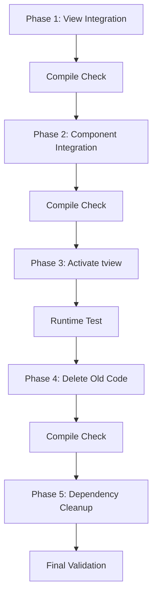

# Design Document

## Overview

This design document outlines the technical approach for completing the incomplete tview migration. The core issue is that tview view and component implementations were created (e.g., `ListViewTview`, `SidebarTview`) but never integrated into the active codebase. The application still runs Bubble Tea code, with `useBubbleTea := true` in tui.go and the Model struct instantiating old Bubble Tea types.

The design follows an **integrate-then-delete** strategy: first update all references to use tview types, verify the application works, then systematically delete obsolete Bubble Tea code. This approach ensures compilation safety at each step and enables easy rollback if issues arise.

## Steering Document Alignment

### Technical Standards (tech.md)

**Modular Architecture**: The remediation maintains the existing modular structure with separate packages for views, components, and core TUI logic. Each tview implementation remains in its designated file.

**Clean Code Principles**: By removing duplicate implementations, we eliminate code confusion and maintain single-responsibility per component. The final codebase will have one implementation per view/component, not two.

**Testing Standards**: All unit tests will be updated to verify the active tview implementations rather than testing obsolete Bubble Tea code.

### Project Structure (structure.md)

**File Organization**: The remediation follows existing structure:
- `cmd/tui/views/` - View implementations (list, detail, forms, help, confirm)
- `cmd/tui/components/` - Reusable components (sidebar, statusbar, metadata, breadcrumb, commandbar)
- `cmd/tui/` - Core TUI orchestration (model.go, tui.go, events.go)

**No New Directories**: All work is done within existing file structure. Only struct definitions and references change.

## Code Reuse Analysis

### Existing Code to Leverage

**All tview implementations already exist and are complete**:
- `ListViewTview` (cmd/tui/views/list.go) - tview.Table implementation ✅
- `DetailViewTview` (cmd/tui/views/detail.go) - tview.Flex + TextViews ✅
- `AddFormTview` (cmd/tui/views/form_add.go) - tview.Form implementation ✅
- `EditFormTview` (cmd/tui/views/form_edit.go) - tview.Form implementation ✅
- `HelpViewTview` (cmd/tui/views/help.go) - tview.TextView implementation ✅
- `ConfirmViewTview` (cmd/tui/views/confirm.go) - tview.Modal implementation ✅
- `SidebarTview` (cmd/tui/components/sidebar.go) - tview.TreeView implementation ✅
- `StatusBarTview` (cmd/tui/components/statusbar.go) - tview.TextView implementation ✅
- `MetadataPanelTview` (cmd/tui/components/metadata_panel.go) - tview.Flex implementation ✅
- `CommandBarTview` (cmd/tui/components/command_bar.go) - tview.Modal + InputField ✅
- `Breadcrumb` (cmd/tui/components/breadcrumb.go) - Already tview-based ✅

**Infrastructure already in place**:
- `tview.Application`, `tview.Pages`, `tview.Flex` fields in Model struct ✅
- `runTview()` function in tui.go ✅
- `setupGlobalInputCapture()` for event handling ✅
- `LayoutManager` with tview.Flex calculations ✅

**What's missing**: Integration only - the code exists but isn't being used.

### Integration Points

**Model Struct** (cmd/tui/model.go):
- Currently: `listView *views.ListView` → Must become: `listView *views.ListViewTview`
- Currently: `sidebar *components.SidebarPanel` → Must become: `sidebar *components.SidebarTview`
- Apply same pattern to all view and component fields

**Constructors** (cmd/tui/model.go - NewModel function):
- Currently: `NewListView()` → Must become: `NewListViewTview()`
- Currently: `NewSidebarPanel()` → Must become: `NewSidebarTview()`
- Apply same pattern to all instantiations

**Application Entry Point** (cmd/tui/tui.go):
- Currently: `useBubbleTea := true` → Must become: `useBubbleTea := false`
- This single line change activates the entire tview code path

## Architecture

### Integration Strategy

The remediation follows a **phased integration approach** with verification gates:



**Phase 1: View Integration**
- Update Model struct view field types
- Update NewModel() view constructors
- Fix compilation errors
- **Gate**: Must compile successfully

**Phase 2: Component Integration**
- Update Model struct component field types
- Update NewModel() component constructors
- Fix compilation errors
- **Gate**: Must compile successfully

**Phase 3: Activate tview**
- Set `useBubbleTea = false` in tui.go
- Run application manually
- Verify basic functionality
- **Gate**: Application must launch and render

**Phase 4: Delete Old Code**
- Delete old Bubble Tea view structs
- Delete old Bubble Tea component structs
- Remove orphaned constructors
- **Gate**: Must compile successfully

**Phase 5: Dependency Cleanup**
- Remove Bubble Tea imports
- Run `go mod tidy`
- Verify no Bubble Tea in dependency tree
- **Gate**: Build succeeds without Bubble Tea

### Deletion Strategy

**Systematic File-by-File Deletion**:

For each file containing dual implementations:
1. Identify old struct (e.g., `type ListView struct`)
2. Identify new struct (e.g., `type ListViewTview struct`)
3. Delete old struct and all its methods
4. Keep new struct and all its methods
5. Commit deletion immediately (enables rollback)

**Files requiring cleanup**:
- `cmd/tui/views/list.go` - Delete `ListView`, keep `ListViewTview`
- `cmd/tui/views/detail.go` - Delete `DetailView`, keep `DetailViewTview`
- `cmd/tui/views/form_add.go` - Delete `AddFormView`, keep `AddFormTview`
- `cmd/tui/views/form_edit.go` - Delete `EditFormView`, keep `EditFormTview`
- `cmd/tui/views/help.go` - Delete `HelpView`, keep `HelpViewTview`
- `cmd/tui/views/confirm.go` - Delete `ConfirmView`, keep `ConfirmViewTview`
- `cmd/tui/components/sidebar.go` - Delete `SidebarPanel`, keep `SidebarTview`
- `cmd/tui/components/statusbar.go` - Delete `StatusBar`, keep `StatusBarTview`
- `cmd/tui/components/metadata_panel.go` - Delete `MetadataPanel`, keep `MetadataPanelTview`
- `cmd/tui/components/command_bar.go` - Delete `CommandBar`, keep `CommandBarTview`

## Components and Interfaces

### Model Struct (cmd/tui/model.go)

**Purpose**: Central state container for TUI application

**Current State** (problematic):
```go
type Model struct {
    // Views - OLD BUBBLE TEA TYPES
    listView    *views.ListView
    detailView  *views.DetailView
    addForm     *views.AddFormView
    editForm    *views.EditFormView
    confirmView *views.ConfirmView
    helpView    *views.HelpView

    // Components - OLD BUBBLE TEA TYPES
    sidebar       *components.SidebarPanel
    statusBar     *components.StatusBar
    metadataPanel *components.MetadataPanel
    commandBar    *components.CommandBar
}
```

**Target State** (corrected):
```go
type Model struct {
    // Views - TVIEW TYPES
    listView    *views.ListViewTview
    detailView  *views.DetailViewTview
    addForm     *views.AddFormTview
    editForm    *views.EditFormTview
    confirmView *views.ConfirmViewTview
    helpView    *views.HelpViewTview

    // Components - TVIEW TYPES
    sidebar       *components.SidebarTview
    statusBar     *components.StatusBarTview
    metadataPanel *components.MetadataPanelTview
    commandBar    *components.CommandBarTview
}
```

**Changes Required**:
- 10 field type changes
- ~10 constructor call changes in NewModel()
- Method calls already compatible (same interface)

### Application Entry (cmd/tui/tui.go)

**Purpose**: Launch TUI with correct framework

**Current State**:
```go
useBubbleTea := true // Toggle to switch between implementations

if useBubbleTea {
    // Bubble Tea path (ACTIVE)
    p := tea.NewProgram(model, ...)
    return p.Run()
} else {
    // tview path (DORMANT)
    return runTview(model)
}
```

**Target State**:
```go
useBubbleTea := false // tview is now active

if useBubbleTea {
    // Bubble Tea path (REMOVED IN CLEANUP)
    return fmt.Errorf("Bubble Tea removed")
} else {
    // tview path (ACTIVE)
    return runTview(model)
}
```

**Changes Required**:
- Change 1 boolean value
- Eventually delete Bubble Tea code path

### View Implementations

All view implementations already exist with tview. **No new code required**. Example:

**ListViewTview** (already exists at cmd/tui/views/list.go:237):
- Uses `tview.Table` for credential display
- Implements filtering, selection, navigation
- Methods: `UpdateCredentials()`, `Filter()`, `GetTable()`, `SetSelectedCallback()`

**DetailViewTview** (already exists at cmd/tui/views/detail.go:207):
- Uses `tview.Flex` + `tview.TextView` for field display
- Implements password masking, clipboard copy
- Methods: `ShowCredential()`, `TogglePasswordMask()`, `GetFlex()`

**Forms already implemented with tview.Form**:
- `AddFormTview` - Service, username, password, notes fields
- `EditFormTview` - Pre-populated form for updates

**Modals already implemented with tview.Modal**:
- `ConfirmViewTview` - Yes/No confirmation dialogs
- `HelpViewTview` - Scrollable help screen

### Component Implementations

All component implementations already exist with tview. **No new code required**. Example:

**SidebarTview** (already exists at cmd/tui/components/sidebar.go:364):
- Uses `tview.TreeView` for category navigation
- Implements expand/collapse, selection
- Methods: `GetTreeView()`, `UpdateCredentials()`, `SetFocus()`

**StatusBarTview** (already exists at cmd/tui/components/statusbar.go:221):
- Uses `tview.TextView` for contextual shortcuts
- Methods: `Render()`, `SetShortcuts()`, `SetCurrentView()`

**Other components already tview-based**:
- `MetadataPanelTview` - tview.Flex with TextViews
- `CommandBarTview` - tview.Modal with InputField
- `Breadcrumb` - Already using tview.TextView (no Tview suffix needed)

## Data Models

**No data model changes required**. The remediation only changes which UI framework renders the data, not the data structures themselves.

**Credential structures unchanged**:
- `vault.Credential`
- `vault.CredentialMetadata`
- `components.Category`

**State enums unchanged**:
- `AppState` (StateList, StateDetail, StateAdd, etc.)
- `PanelFocus` (FocusSidebar, FocusMain, etc.)

## Error Handling

### Integration Phase Errors

**Scenario 1: Compilation Error After Type Change**
- **Cause**: Method call incompatibility between old and new types
- **Handling**: Identify method signature differences, update call sites
- **User Impact**: None (caught at compile time)

**Scenario 2: Runtime Error After Activation**
- **Cause**: tview view not properly initialized
- **Handling**: Check constructor parameters, verify tview primitive setup
- **User Impact**: Application crashes on launch (caught in testing)

**Scenario 3: Missing Method on tview Type**
- **Cause**: Old code calls method that doesn't exist on tview type
- **Handling**: Implement missing method or refactor call site
- **User Impact**: None (caught at compile time)

### Deletion Phase Errors

**Scenario 1: Reference to Deleted Struct**
- **Cause**: Missed reference update during integration phase
- **Handling**: Compilation will fail, update missed reference
- **User Impact**: None (caught at compile time)

**Scenario 2: Test Failure After Deletion**
- **Cause**: Test still instantiates old struct
- **Handling**: Update test to use new tview constructor
- **User Impact**: None (caught in test execution)

### Dependency Cleanup Errors

**Scenario 1: go mod tidy Re-adds Bubble Tea**
- **Cause**: Remaining import of Bubble Tea package
- **Handling**: Search codebase for remaining imports, remove them
- **User Impact**: None (caught during dependency cleanup)

**Scenario 2: Build Fails Without Bubble Tea**
- **Cause**: Missed import cleanup
- **Handling**: Identify file with Bubble Tea import, remove it
- **User Impact**: None (caught at compile time)

## Testing Strategy

### Unit Testing

**View Tests** (cmd/tui/views/*_test.go):
- Update constructors: `NewListView()` → `NewListViewTview()`
- Update type assertions: `*ListView` → `*ListViewTview`
- Verify tview primitive access: `GetTable()`, `GetForm()`, `GetFlex()`
- All existing test scenarios remain valid

**Component Tests** (cmd/tui/components/*_test.go):
- Update constructors: `NewSidebarPanel()` → `NewSidebarTview()`
- Update type assertions: `*SidebarPanel` → `*SidebarTview`
- Verify tview primitive access: `GetTreeView()`, `GetTextView()`
- All existing test scenarios remain valid

**Expected Results**: All tests pass after updates

### Integration Testing

**CLI Integration Tests** (test/integration_test.go):
- No changes required - these test CLI mode, not TUI mode
- Verify they continue to pass

**TUI Integration Tests** (test/tui_integration_test.go):
- Update to work with tview (may need refactoring)
- Note: Full TUI integration tests are difficult with tview (requires real terminal)
- Rely more heavily on manual testing

**Expected Results**: CLI tests pass, TUI tests updated or skipped with note

### Manual Testing

**Visual Regression Checklist** (docs/development/TVIEW_MIGRATION_CHECKLIST.md):
- Execute comprehensive manual testing checklist
- Verify all views render correctly
- Verify all keyboard shortcuts work
- Verify responsive breakpoints trigger correctly
- Test on multiple terminal emulators (Windows Terminal, iTerm2, etc.)

**Functional Testing Scenarios**:
1. Launch TUI → Credential list displays
2. Navigate with j/k → Selection moves correctly
3. Press Enter → Detail view displays
4. Press 'a' → Add form displays
5. Fill form, submit → Credential added, list refreshes
6. Select credential, press 'e' → Edit form pre-populated
7. Edit, submit → Changes saved, detail updated
8. Press 'd' → Delete confirmation displays
9. Confirm → Credential deleted, list refreshes
10. Press '/' → Search activates, filters in real-time
11. Resize terminal → Panels show/hide at breakpoints

**Expected Results**: All scenarios work identically to Bubble Tea version

### Performance Testing

**Benchmark Validation**:
- Startup time < 200ms (original requirement)
- Layout recalculation < 50ms
- Memory usage <= 50MB

**Testing Approach**:
- Run performance benchmarks before and after remediation
- Compare metrics to ensure no regression
- tview should perform equal or better than Bubble Tea

**Expected Results**: Performance meets or exceeds original requirements

## Implementation Phases

### Phase 1: View Integration (Tasks 1-5)
- Update Model view fields
- Update view constructors
- Fix compilation
- Verify build succeeds

### Phase 2: Component Integration (Tasks 6-8)
- Update Model component fields
- Update component constructors
- Verify build succeeds

### Phase 3: Activation (Tasks 9-10)
- Set useBubbleTea = false
- Manual testing
- Fix runtime issues

### Phase 4: Deletion (Tasks 11-12)
- Delete old view structs
- Delete old component structs
- Verify build succeeds

### Phase 5: Cleanup (Tasks 13-15)
- Remove Bubble Tea dependencies
- Update tests
- Final validation

**Total Estimated Tasks**: 15 tasks
**Estimated Completion Time**: 12-18 hours

## Risk Mitigation

**Risk 1: Subtle Method Signature Differences**
- **Mitigation**: Compiler will catch these, fix on a case-by-case basis
- **Likelihood**: Medium
- **Impact**: Low (compilation failures are easy to fix)

**Risk 2: Runtime Behavior Differences**
- **Mitigation**: Comprehensive manual testing with checklist
- **Likelihood**: Medium
- **Impact**: Medium (requires debugging and fixes)

**Risk 3: Missed References During Integration**
- **Mitigation**: Systematic file-by-file deletion will catch via compilation
- **Likelihood**: Low
- **Impact**: Low (caught at compile time)

**Risk 4: Test Coverage Gaps**
- **Mitigation**: Update tests systematically, verify coverage doesn't drop
- **Likelihood**: Low
- **Impact**: Medium (may miss bugs)

**Overall Risk Assessment**: Low-Medium. The work is mechanical with clear verification gates.
