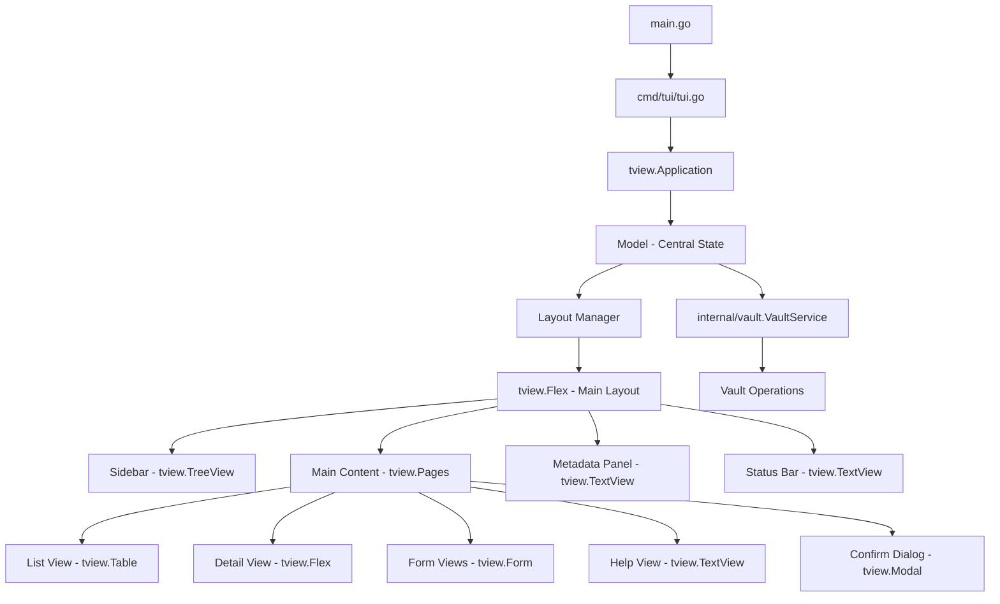

# Design Document

## Overview

This design specifies the migration of pass-cli's TUI layer from Bubble Tea + Lipgloss to tview. The migration preserves all existing functionality while replacing manual layout calculations with tview's native Flex containers. The architecture maintains a centralized state model, component-based design, and clean separation between business logic and presentation.

**Migration Strategy**: Incremental component-by-component replacement, starting with infrastructure (layout, state management), then views (list, detail, forms), and finally specialized components (sidebar, panels). All components will be tested individually before integration.

## Steering Document Alignment

### Technical Standards (tech.md)

**Framework Migration**:
- **From**: Bubble Tea (Elm architecture) + Lipgloss (styling) + Bubbles (components)
- **To**: tview (terminal UI framework) + tcell (terminal handling)
- **Rationale**: tview provides native Flex layout containers that eliminate manual height calculation errors discovered during playground testing

**Dependency Changes**:
```go
// Remove
github.com/charmbracelet/bubbletea v1.3.10
github.com/charmbracelet/lipgloss v1.1.0
github.com/charmbracelet/bubbles v0.21.0

// Add
github.com/rivo/tview v0.42.0
github.com/gdamore/tcell/v2 v2.9.0
```

**Architecture Patterns Preserved**:
- Layered architecture (TUI → Service → Storage → Crypto)
- Service layer (internal/vault) remains unchanged
- Cross-platform system integration (keychain, clipboard) unchanged
- State management with centralized Model struct

**Performance Requirements**:
- Maintains <200ms TUI startup time
- <50ms layout recalculation on resize (improved from manual calculations)
- <=50MB memory usage during operation

### Project Structure (structure.md)

**Directory Organization** - Preserved with minor adjustments:
```
cmd/tui/
├── tui.go               # Entry point (tview.Application initialization)
├── model.go             # Central state container
├── events.go            # Event handlers (replaces Update())
├── keys.go              # Keyboard bindings
├── helpers.go           # Utility functions
├── components/          # Reusable TUI components
│   ├── sidebar.go       # Category tree sidebar (tview.TreeView)
│   ├── statusbar.go     # Status bar (tview.TextView)
│   ├── metadata_panel.go    # Metadata display (tview.Flex + TextViews)
│   ├── process_panel.go     # Process status (tview.TextView)
│   ├── command_bar.go       # Command palette (tview.InputField + List)
│   ├── breadcrumb.go        # Navigation breadcrumb (tview.TextView)
│   ├── layout_manager.go    # Responsive layout logic
│   └── category_tree.go     # Category tree data structure
├── views/               # Screen-level components
│   ├── list.go          # Credential list (tview.Table or List)
│   ├── detail.go        # Credential detail (tview.Flex + TextViews)
│   ├── form_add.go      # Add credential (tview.Form)
│   ├── form_edit.go     # Edit credential (tview.Form)
│   ├── help.go          # Help screen (tview.TextView)
│   └── confirm.go       # Confirmation dialog (tview.Modal)
└── styles/              # Styling and theming
    └── theme.go         # Color scheme (tcell.Color instead of lipgloss.Color)
```

**Key Changes**:
- `model.go`: Central state with tview primitives instead of Bubble Tea models
- `events.go`: Event handlers using tview's event system (replaces Bubble Tea's Update)
- Components use tview primitives (TreeView, Table, Form, TextView, Flex, Modal)
- Styles use tcell.Color instead of lipgloss.Color

## Code Reuse Analysis

### Existing Components to Leverage

**100% Reuse (No Changes)**:
- **internal/vault**: Complete vault service layer with all business logic
- **internal/crypto**: Encryption/decryption operations
- **internal/storage**: File operations and persistence
- **internal/keychain**: System keychain integration
- **cmd/helpers.go**: Password reading utilities

**Adapt for tview (Structure Preserved)**:
- **cmd/tui/components/category_tree.go**: Category tree data structure and logic (reuse algorithm, adapt to tview.TreeView)
- **cmd/tui/components/layout_manager.go**: Responsive breakpoint logic (reuse calculations, integrate with tview.Flex)
- **cmd/tui/styles/theme.go**: Color scheme and icons (convert lipgloss.Color to tcell.Color)
- **cmd/tui/keys.go**: Keyboard binding definitions (adapt to tview.SetInputCapture)

**Complete Rewrite (Architecture Changes)**:
- **cmd/tui/model.go**: Replace Bubble Tea's Model-Update-View with tview state management
- **cmd/tui/tui.go**: Replace tea.Program with tview.Application
- **All views/** (list, detail, forms, help, confirm): Replace Bubble Tea components with tview primitives
- **All components/** (sidebar, panels, statusbar, breadcrumb, command bar): Replace Lipgloss rendering with tview widgets

### Integration Points

**Unchanged Integration Points**:
- **Vault Service** (internal/vault.VaultService): All CRUD operations, search, category management
- **Keychain Service** (internal/keychain.Service): Master password retrieval
- **File System**: Vault persistence at ~/.pass-cli/vault.enc
- **Clipboard**: Cross-platform credential copying (github.com/atotto/clipboard)

**Modified Integration Points**:
- **Event Loop**: tview.Application.Run() replaces tea.Program.Run()
- **Input Handling**: tview.SetInputCapture() replaces tea.KeyMsg handling
- **Rendering**: tview automatic rendering replaces manual View() methods
- **Layout**: tview.Flex dynamic layout replaces manual Lipgloss JoinHorizontal/JoinVertical

## Architecture

### System Architecture



### Component Architecture

**tview.Application** (Entry Point):
- Manages event loop and screen rendering
- Handles global input capture for shortcuts
- Coordinates focus between panels

**Model** (Central State Container):
```go
type Model struct {
    // Application state
    app             *tview.Application
    pages           *tview.Pages  // View stack management
    mainLayout      *tview.Flex   // Root layout container

    // Current state
    currentView     string        // "list", "detail", "add", "edit", "help"
    currentCategory string
    selectedCred    string

    // Services
    vaultService    *vault.VaultService
    keychainService *keychain.Service

    // Data
    credentials     []*vault.Credential
    categories      []string

    // UI Components
    sidebar         *Sidebar
    listView        *ListView
    detailView      *DetailView
    addForm         *AddForm
    editForm        *EditForm
    helpView        *HelpView
    metadataPanel   *MetadataPanel
    statusBar       *StatusBar
    commandBar      *CommandBar
    breadcrumb      *Breadcrumb

    // Layout state
    layoutManager   *LayoutManager
    width           int
    height          int

    // Visibility flags
    sidebarVisible    bool
    metadataVisible   bool
    commandBarVisible bool
}
```

**Layout Manager** (Responsive Logic):
```go
type LayoutManager struct {
    breakpoints map[string]int // {"sidebar": 80, "metadata": 120}
    flexRatios  FlexRatios     // {sidebar: 1, main: 2, metadata: 1}
}

func (lm *LayoutManager) CalculateLayout(width int) LayoutConfig {
    // Returns which panels to show and their flex ratios
    // Based on terminal width breakpoints
}
```

## Components and Interfaces

### Component 1: Sidebar (Category Tree)
- **Purpose:** Display hierarchical category navigation using tview.TreeView
- **Interfaces:**
  - `func NewSidebar(categories []string) *Sidebar`
  - `func (s *Sidebar) GetTreeView() *tview.TreeView`
  - `func (s *Sidebar) SetSelectedCallback(func(string))`
  - `func (s *Sidebar) UpdateCategories(categories []string)`
  - `func (s *Sidebar) SetFocused(focused bool)`
- **Dependencies:** tview.TreeView, category tree data structure
- **Reuses:** category_tree.go logic, theme.go colors
- **Implementation:**
  ```go
  type Sidebar struct {
      tree     *tview.TreeView
      root     *tview.TreeNode
      callback func(string)
  }
  ```

### Component 2: ListView (Credential List)
- **Purpose:** Display credential list with selection and filtering
- **Interfaces:**
  - `func NewListView() *ListView`
  - `func (lv *ListView) GetTable() *tview.Table`
  - `func (lv *ListView) UpdateCredentials([]*vault.Credential)`
  - `func (lv *ListView) SetSelectedCallback(func(string))`
  - `func (lv *ListView) Filter(query string)`
- **Dependencies:** tview.Table
- **Reuses:** Vault service for data, theme.go for styling
- **Implementation:**
  ```go
  type ListView struct {
      table       *tview.Table
      credentials []*vault.Credential
      filtered    []*vault.Credential
      callback    func(string)
  }
  ```

### Component 3: DetailView (Credential Details)
- **Purpose:** Display selected credential details with copy actions
- **Interfaces:**
  - `func NewDetailView() *DetailView`
  - `func (dv *DetailView) GetContainer() tview.Primitive`
  - `func (dv *DetailView) ShowCredential(cred *vault.Credential)`
  - `func (dv *DetailView) SetEditCallback(func())`
  - `func (dv *DetailView) SetDeleteCallback(func())`
- **Dependencies:** tview.Flex, tview.TextView
- **Reuses:** Clipboard service, theme.go
- **Implementation:**
  ```go
  type DetailView struct {
      container  *tview.Flex
      serviceText    *tview.TextView
      usernameText   *tview.TextView
      passwordText   *tview.TextView  // Masked by default
      metadataText   *tview.TextView
      currentCred    *vault.Credential
  }
  ```

### Component 4: AddForm & EditForm
- **Purpose:** Forms for adding/editing credentials
- **Interfaces:**
  - `func NewAddForm() *AddForm`
  - `func (af *AddForm) GetForm() *tview.Form`
  - `func (af *AddForm) SetSubmitCallback(func(service, username, password, category string))`
  - `func (af *AddForm) Reset()`
  - `func NewEditForm() *EditForm`
  - `func (ef *EditForm) Populate(cred *vault.Credential)`
- **Dependencies:** tview.Form
- **Reuses:** Vault service validation logic
- **Implementation:**
  ```go
  type AddForm struct {
      form     *tview.Form
      callback func(string, string, string, string)
  }

  type EditForm struct {
      form     *tview.Form
      credID   string
      callback func(string, string, string, string, string)
  }
  ```

### Component 5: StatusBar
- **Purpose:** Display keyboard shortcuts and context hints
- **Interfaces:**
  - `func NewStatusBar() *StatusBar`
  - `func (sb *StatusBar) GetTextView() *tview.TextView`
  - `func (sb *StatusBar) Update(context string, hints []string)`
- **Dependencies:** tview.TextView
- **Reuses:** keys.go keybinding definitions, theme.go
- **Implementation:**
  ```go
  type StatusBar struct {
      textView *tview.TextView
  }
  ```

### Component 6: MetadataPanel
- **Purpose:** Display credential metadata (created, updated, usage)
- **Interfaces:**
  - `func NewMetadataPanel() *MetadataPanel`
  - `func (mp *MetadataPanel) GetContainer() *tview.Flex`
  - `func (mp *MetadataPanel) ShowMetadata(cred *vault.Credential)`
- **Dependencies:** tview.Flex, tview.TextView
- **Reuses:** Vault credential model, theme.go
- **Implementation:**
  ```go
  type MetadataPanel struct {
      container *tview.Flex
      fields    map[string]*tview.TextView
  }
  ```

### Component 7: CommandBar (Command Palette)
- **Purpose:** Quick command execution via fuzzy search
- **Interfaces:**
  - `func NewCommandBar() *CommandBar`
  - `func (cb *CommandBar) Show()`
  - `func (cb *CommandBar) Hide()`
  - `func (cb *CommandBar) GetModal() tview.Primitive`
- **Dependencies:** tview.InputField, tview.List, tview.Modal
- **Reuses:** Command definitions, fuzzy search logic
- **Implementation:**
  ```go
  type CommandBar struct {
      modal      *tview.Flex
      input      *tview.InputField
      list       *tview.List
      commands   []Command
  }
  ```

## Data Models

### Model State Structure
```go
type Model struct {
    // Core application
    app             *tview.Application
    pages           *tview.Pages
    mainLayout      *tview.Flex

    // State
    currentView     string
    currentCategory string
    selectedCredID  string

    // Services (unchanged from Bubble Tea version)
    vaultService    *vault.VaultService
    keychainService *keychain.Service
    vaultPath       string

    // Data (unchanged structure)
    credentials     []*vault.Credential
    categories      []string

    // UI Components (tview primitives)
    sidebar         *Sidebar
    listView        *ListView
    detailView      *DetailView
    addForm         *AddForm
    editForm        *EditForm
    helpView        *HelpView
    metadataPanel   *MetadataPanel
    statusBar       *StatusBar
    commandBar      *CommandBar
    breadcrumb      *Breadcrumb

    // Layout management
    layoutManager   *LayoutManager
    width           int
    height          int

    // Visibility state
    sidebarVisible    bool
    metadataVisible   bool
    commandBarVisible bool

    // Error state
    err     error
    errMsg  string
}
```

### LayoutConfig
```go
type LayoutConfig struct {
    ShowSidebar    bool
    ShowMetadata   bool
    SidebarFlex    int  // Flex ratio (e.g., 1 for 1:2:1)
    MainFlex       int  // Flex ratio (e.g., 2 for 1:2:1)
    MetadataFlex   int  // Flex ratio (e.g., 1 for 1:2:1)
}
```

### ViewConfig
```go
type ViewConfig struct {
    Name        string  // "list", "detail", "add", "edit", "help"
    Title       string
    Keybindings []KeyBinding
    Focusable   bool
}
```

## Error Handling

### Error Scenarios

1. **Vault Unlock Failure**
   - **Handling:** Display password prompt with error message, allow retry
   - **User Impact:** Modal password dialog with red error text below input
   - **Implementation:** tview.Modal with tview.InputField and error TextView

2. **Credential Operation Failure (Add/Edit/Delete)**
   - **Handling:** Show error in modal dialog, return to previous view on dismiss
   - **User Impact:** Red-bordered modal with error message and "OK" button
   - **Implementation:** tview.Modal with error styling from theme.go

3. **Layout Rendering Failure (Terminal Too Small)**
   - **Handling:** Display "terminal too small" message when width < 80 or height < 20
   - **User Impact:** Centered message with minimum size requirements
   - **Implementation:** Dedicated tview.TextView with centered alignment

4. **Keychain Integration Failure**
   - **Handling:** Gracefully fallback to password prompt, log warning
   - **User Impact:** Standard password prompt (no visible error unless verbose mode)
   - **Implementation:** Silent fallback in tui.go initialization

5. **Search/Filter No Results**
   - **Handling:** Display "No credentials found" in list view
   - **User Impact:** Gray text in center of list view
   - **Implementation:** tview.Table with single-row placeholder

## Testing Strategy

### Unit Testing

**Component Tests** (tview component isolation):
- `TestSidebar_CategorySelection`: Verify TreeView node selection triggers callback
- `TestListView_CredentialFiltering`: Test credential filtering logic
- `TestDetailView_CredentialDisplay`: Verify credential field rendering
- `TestAddForm_Validation`: Test form input validation
- `TestStatusBar_ContextUpdate`: Verify status bar updates with context
- `TestLayoutManager_Breakpoints`: Test responsive layout calculations

**State Management Tests**:
- `TestModel_ViewTransitions`: Verify state changes during view navigation
- `TestModel_CategorySelection`: Test category filter application
- `TestModel_CredentialSelection`: Verify credential selection updates detail view

**Migration Parity Tests** (ensure feature equivalence):
- `TestMigration_AllViewsAccessible`: Verify all Bubble Tea views exist in tview
- `TestMigration_KeybindingsWork`: Test all keyboard shortcuts function correctly
- `TestMigration_VaultOperations`: Ensure CRUD operations work identically

### Integration Testing

**Full Workflow Tests**:
- `TestIntegration_AddCredential`: Complete flow from list → add form → save → list update
- `TestIntegration_EditCredential`: Select → detail → edit → save → verify update
- `TestIntegration_DeleteCredential`: Select → delete confirmation → execute → list update
- `TestIntegration_Search`: Category filter + search → result display
- `TestIntegration_CategoryNavigation`: Sidebar navigation → filtered list view

**Layout Tests**:
- `TestLayout_ResponsiveBreakpoints`: Verify panel visibility at different terminal widths
- `TestLayout_FlexRatios`: Confirm correct width distribution (1:2:1, etc.)
- `TestLayout_MinimumSize`: Test terminal too small message display
- `TestLayout_DynamicResize`: Verify layout updates on terminal resize events

**Service Integration Tests**:
- `TestVaultService_Integration`: Verify vault operations work through tview UI
- `TestKeychain_Integration`: Test master password retrieval flow
- `TestClipboard_Integration`: Verify credential copying works

### End-to-End Testing

**User Journey Tests**:
- `TestE2E_FirstTimeSetup`: Initialize vault → set password → keychain save → unlock
- `TestE2E_DailyWorkflow`: Unlock → browse → search → copy → close
- `TestE2E_CredentialManagement`: Add → edit → delete → verify persistence
- `TestE2E_CategoryManagement`: Create category → assign credentials → filter by category

**Regression Tests** (Bubble Tea feature parity):
- `TestRegression_AllFeatures`: Comprehensive checklist of Bubble Tea features
- `TestRegression_Performance`: Ensure tview meets performance requirements (<200ms startup)
- `TestRegression_TerminalCompatibility`: Test on Windows Terminal, iTerm2, macOS Terminal

**Visual Regression Tests** (Manual):
- Screenshot comparison: Bubble Tea vs tview at various terminal sizes
- Color scheme validation: Verify theme.go colors render correctly
- Border and layout visual inspection

### Test Coverage Goals
- **Unit Tests**: 85% coverage of component logic
- **Integration Tests**: Cover all critical user workflows
- **E2E Tests**: Validate complete feature parity with Bubble Tea version
- **Regression Tests**: Zero functionality loss during migration
