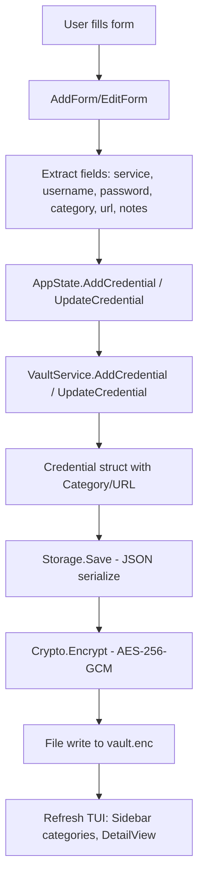

# Design Document

## Overview

This design addresses completion of the tview TUI implementation by extending the data model to support Category and URL fields, implementing form pre-population, improving UI polish, and resolving all TODO comments. The implementation focuses on minimal invasive changes while maintaining the existing tview architecture and component structure.

The tview TUI currently has core functionality working (delete confirmation, copy feedback, credential display) but is missing data model support for optional fields and has several UI polish issues. This design ensures all requirements are met while preserving the existing modular component architecture.

## Steering Document Alignment

### Technical Standards (tech.md)

**From tech.md - Application Architecture:**
- **Layered architecture**: Changes follow TUI Layer → Service Layer → Storage Layer hierarchy
- **Bubble Tea to tview migration**: This work completes the tview implementation (completing the migration mentioned in tech.md)
- **Component-Based Design**: Maintain isolation between components (forms, detail view, status bar, etc.)

**Dependencies:**
- Uses existing `github.com/rivo/tview v0.42.0` (no new dependencies)
- Uses existing `github.com/gdamore/tcell/v2 v2.9.0` for styling
- Extends `internal/vault` package (no new crypto dependencies)

### Project Structure (structure.md)

**File Organization:**
- **Data model changes**: `internal/vault/vault.go` (Credential struct)
- **TUI components**: `cmd/tui-tview/components/*.go` (forms, detail view, status bar)
- **TUI models**: `cmd/tui-tview/models/state.go` (AppState methods)
- **TUI events**: `cmd/tui-tview/events/handlers.go` (help modal formatting)
- **Styles**: `cmd/tui-tview/styles/*.go` (form styling fixes)

**Follows existing patterns:**
- One component per file principle
- Component-based UI architecture
- Styles centralized in styles/ directory
- Models separate from view components

## Code Reuse Analysis

### Existing Components to Leverage

- **Credential struct** (`internal/vault/vault.go:37-45`): Extend with Category and URL fields
- **AddForm/EditForm** (`cmd/tui-tview/components/forms.go`): Already have UI for Category/URL, need data plumbing
- **AppState** (`cmd/tui-tview/models/state.go`): Extend AddCredential/UpdateCredential signatures
- **DetailView** (`cmd/tui-tview/components/detail.go`): Already fetches full credentials, add Category/URL display
- **StatusBar** (`cmd/tui-tview/components/statusbar.go`): Already has context-aware shortcuts, improve formatting
- **Help modal** (`cmd/tui-tview/events/handlers.go:216-246`): Exists but needs formatting improvements
- **Theme system** (`cmd/tui-tview/styles/theme.go`): Centralized styling for consistency

### Integration Points

- **Vault Service** (`internal/vault/vault.go`): AddCredential and UpdateCredential methods need signature extensions
- **Storage Layer** (`internal/storage/storage.go`): JSON serialization automatically handles new fields
- **Crypto Layer**: No changes needed (encrypts entire vault JSON)
- **Forms → AppState**: Connect form fields to extended method signatures
- **Sidebar**: GetCategories() already exists in AppState, will automatically work with Category field

### Existing Features That Already Work

**Based on user testing:**
- ✅ Delete confirmation modal (press 'd')
- ✅ Copy password to clipboard (press 'c')
- ✅ Copy feedback in status bar
- ❓ Search UI (needs verification but likely exists)

These features require **no implementation** - only verification testing.

## Architecture

The design maintains the existing layered architecture with minimal invasive changes:

```
TUI Layer (cmd/tui-tview/)
    ├── Components (forms, detail, statusbar, sidebar)
    ├── Models (AppState - orchestration)
    └── Events (global handlers, help modal)
         ↓
Service Layer (internal/vault/)
    └── VaultService.AddCredential(), UpdateCredential()
         ↓
Storage Layer (internal/storage/)
    └── Automatic JSON serialization of extended Credential
         ↓
Crypto Layer (internal/crypto/)
    └── Unchanged (encrypts entire vault)
```

### Modular Design Principles

- **Single File Responsibility**: Each component (forms.go, detail.go, statusbar.go) handles one UI concern
- **Component Isolation**: Forms don't directly access vault, they use AppState
- **Service Layer Separation**: TUI → AppState → VaultService → Storage
- **Minimal Changes**: Extend existing structures rather than creating new ones

### Data Flow: Add/Edit Credential



## Components and Interfaces

### Component 1: Credential Data Model Extension

**File:** `internal/vault/vault.go`

**Purpose:** Add Category and URL as optional fields to support credential organization and quick access to web interfaces

**Changes:**
```go
type Credential struct {
    Service     string                  `json:"service"`
    Username    string                  `json:"username"`
    Password    string                  `json:"password"`
    Category    string                  `json:"category"`    // NEW: optional category
    URL         string                  `json:"url"`         // NEW: optional URL
    Notes       string                  `json:"notes"`
    CreatedAt   time.Time               `json:"created_at"`
    UpdatedAt   time.Time               `json:"updated_at"`
    UsageRecord map[string]UsageRecord  `json:"usage_records"`
}
```

**Backward Compatibility:** Existing vaults without Category/URL will deserialize with empty strings (Go default)

**Interfaces:**
- `AddCredential(service, username, password, category, url, notes string) error` - Extended signature
- `UpdateCredential(service, username, password, category, url, notes string) error` - Extended signature

**Dependencies:** None (pure data model)

**Reuses:** Existing Credential structure, UsageRecord tracking

### Component 2: AppState Methods Extension

**File:** `cmd/tui-tview/models/state.go`

**Purpose:** Extend credential management methods to accept and pass through Category/URL/Notes

**Changes:**
```go
func (as *AppState) AddCredential(service, username, password, category, url, notes string) error {
    // Call VaultService with extended parameters
    return as.vaultService.AddCredential(service, username, password, category, url, notes)
}

func (as *AppState) UpdateCredential(service, username, password, category, url, notes string) error {
    // Call VaultService with extended parameters
    return as.vaultService.UpdateCredential(service, username, password, category, url, notes)
}
```

**Interfaces:** Same as VaultService (pass-through)

**Dependencies:** VaultService

**Reuses:** Existing AppState pattern of wrapping VaultService calls

### Component 3: Form Pre-Population

**File:** `cmd/tui-tview/components/forms.go`

**Purpose:** Pre-populate EditForm fields with existing credential data

**Current State:**
- Lines 198, 204: Password and Notes intentionally left empty (TODO comments)
- Lines 84-85: Category/URL extracted but not passed to AppState (TODO comment)

**Changes:**

**EditForm.buildFormFieldsWithValues():**
```go
// Fetch full credential to get all fields including password
fullCred, err := ef.appState.GetFullCredential(ef.credential.Service)
if err != nil {
    // Handle error - show in status bar
    return
}

// Pre-populate all fields
ef.AddInputField("Service", ef.credential.Service, 40, nil, nil)
ef.AddInputField("Username", ef.credential.Username, 40, nil, nil)
ef.AddPasswordField("Password", fullCred.Password, 40, '*', nil) // FIXED: show password (masked)
ef.AddDropDown("Category", categories, categoryIndex, nil)        // FIXED: pre-select category
ef.AddInputField("URL", fullCred.URL, 50, nil, nil)              // FIXED: show URL
ef.AddTextArea("Notes", fullCred.Notes, 50, 5, 0, nil)           // FIXED: show notes
```

**AddForm.onAddPressed():**
```go
// Extract ALL fields (not just service/username/password)
service := af.GetFormItem(0).(*tview.InputField).GetText()
username := af.GetFormItem(1).(*tview.InputField).GetText()
password := af.GetFormItem(2).(*tview.InputField).GetText()
_, categoryText := af.GetFormItem(3).(*tview.DropDown).GetCurrentOption() // FIXED
url := af.GetFormItem(4).(*tview.InputField).GetText()                     // FIXED
notes := af.GetFormItem(5).(*tview.TextArea).GetText()                     // FIXED

// Pass all fields to AppState
err := af.appState.AddCredential(service, username, password, categoryText, url, notes)
```

**EditForm.onSavePressed():**
```go
// Extract ALL fields
service := ef.GetFormItem(0).(*tview.InputField).GetText()
username := ef.GetFormItem(1).(*tview.InputField).GetText()
password := ef.GetFormItem(2).(*tview.InputField).GetText()
_, categoryText := ef.GetFormItem(3).(*tview.DropDown).GetCurrentOption()
url := ef.GetFormItem(4).(*tview.InputField).GetText()
notes := ef.GetFormItem(5).(*tview.TextArea).GetText()

// If password is empty, preserve existing (user didn't change it)
if password == "" {
    fullCred, _ := ef.appState.GetFullCredential(ef.credential.Service)
    password = fullCred.Password
}

// Pass all fields to AppState
err := ef.appState.UpdateCredential(service, username, password, categoryText, url, notes)
```

**Interfaces:**
- `NewEditForm(appState, credential)` - Unchanged, but now pre-populates all fields
- `onAddPressed()`, `onSavePressed()` - Now extract and pass all 6 fields

**Dependencies:** AppState.GetFullCredential(), AppState.AddCredential(), AppState.UpdateCredential()

**Reuses:** Existing form structure, GetFormItem() pattern

### Component 4: DetailView Enhancement

**File:** `cmd/tui-tview/components/detail.go`

**Purpose:** Display Category and URL in credential details

**Changes to formatCredential():**
```go
// After username, before password
if cred.Category != "" {
    b.WriteString(fmt.Sprintf("[gray]Category:[-]   [white]%s[-]\n", cred.Category))
}

if cred.URL != "" {
    b.WriteString(fmt.Sprintf("[gray]URL:[-]        [white]%s[-]\n", cred.URL))
}
```

**Interfaces:** Unchanged (still Refresh())

**Dependencies:** CredentialMetadata (extended with Category/URL)

**Reuses:** Existing formatCredential() pattern

### Component 5: StatusBar Shortcut Improvements

**File:** `cmd/tui-tview/components/statusbar.go`

**Purpose:** Make keyboard shortcuts clearer and more explicit

**Current State (line 99-112):**
```go
case FocusSidebar:
    return "[gray][Tab] Next  [↑↓] Navigate  [Enter] Select  [n] New  [?] Help  [q] Quit[-]"
```

**Improved Format:**
```go
case FocusSidebar:
    return "[white]Tab[-][gray] Next  [white]↑↓[-][gray] Navigate  [white]Enter[-][gray] Select  [white]n[-][gray] New  [white]?[-][gray] Help  [white]q[-][gray] Quit[-]"
```

**Rationale:** Use white for keys, gray for actions - improves scannability

**Interfaces:** Unchanged

**Dependencies:** None

**Reuses:** Existing context-aware shortcut system

### Component 6: Help Modal Formatting

**File:** `cmd/tui-tview/events/handlers.go`

**Purpose:** Improve help modal readability with proper alignment and formatting

**Current State (lines 216-236):**
```
helpText := `[yellow]Keyboard Shortcuts[-]

[cyan]Navigation[-]
  Tab          - Next component
  Shift+Tab    - Previous component
  ↑/↓          - Navigate lists
  Enter        - Select / View details
```

**Improved Format:**
```
helpText := `
[yellow]═══════════════════════════════════════════════[-]
[yellow]           Keyboard Shortcuts[-]
[yellow]═══════════════════════════════════════════════[-]

[cyan]Navigation[-]
  [white]Tab[-]              Next component
  [white]Shift+Tab[-]        Previous component
  [white]↑ / ↓[-]            Navigate lists
  [white]Enter[-]            Select / View details

[cyan]Actions[-]
  [white]n[-]                New credential
  [white]e[-]                Edit credential
  [white]d[-]                Delete credential
  [white]p[-]                Toggle password visibility
  [white]c[-]                Copy password

[cyan]General[-]
  [white]?[-]                Show this help
  [white]q[-]                Quit application
  [white]Esc[-]              Close modal / Go back
  [white]Ctrl+C[-]           Quit application
`
```

**Rationale:**
- Add header separator for visual hierarchy
- Left-align keys, descriptions for readability
- Use white for keys (consistent with status bar improvement)
- Add spacing between sections

**Interfaces:** Unchanged (still showHelpModal())

**Dependencies:** tview.Modal

**Reuses:** Existing modal pattern

### Component 7: Form Styling Fixes

**File:** `cmd/tui-tview/styles/theme.go` or new `cmd/tui-tview/styles/forms.go`

**Purpose:** Fix input field background sizing issues

**Issues:**
- Top 3 input fields: background doesn't fill allotted space
- URL input field: background extends past boundaries

**Root Cause:** Likely tview.Form field width vs background width mismatch

**Solution:** Investigate ApplyFormStyle() and ensure:
```go
func ApplyFormStyle(form *tview.Form) {
    theme := GetCurrentTheme()

    // Set form background
    form.SetBackgroundColor(theme.BackgroundColor)
    form.SetFieldBackgroundColor(theme.InputFieldBg)  // Ensure consistent field backgrounds
    form.SetFieldTextColor(theme.TextColor)
    form.SetButtonBackgroundColor(theme.ButtonBg)
    form.SetButtonTextColor(theme.ButtonText)

    // Ensure fields have consistent width and padding
    // May need to iterate form items and set individual styles
}
```

**Note:** This may require tview-specific investigation as background rendering is framework-controlled.

**Interfaces:** ApplyFormStyle(form *tview.Form)

**Dependencies:** tview.Form styling API

**Reuses:** Existing theme system

## Data Models

### Extended Credential Model

```go
type Credential struct {
    Service     string                  `json:"service"`      // Required
    Username    string                  `json:"username"`     // Required
    Password    string                  `json:"password"`     // Required
    Category    string                  `json:"category"`     // Optional - for grouping
    URL         string                  `json:"url"`          // Optional - web interface link
    Notes       string                  `json:"notes"`        // Optional - additional info
    CreatedAt   time.Time               `json:"created_at"`   // Automatic
    UpdatedAt   time.Time               `json:"updated_at"`   // Automatic
    UsageRecord map[string]UsageRecord  `json:"usage_records"`// Automatic tracking
}
```

**Validation:**
- Service, Username, Password: Required (validated in add/update methods)
- Category, URL, Notes: Optional (empty string allowed)
- Category: No format restrictions, any user string accepted
- URL: No validation (not security-critical, user responsibility)

**Default Values:**
- Category: `""` (empty string, displays as "Uncategorized" in sidebar)
- URL: `""` (empty string, not displayed in detail view if empty)
- Notes: `""` (empty string, not displayed if empty)

### CredentialMetadata (TUI-specific)

**File:** `cmd/tui-tview/models/state.go` or `internal/vault/vault.go`

**Extension:**
```go
type CredentialMetadata struct {
    Service      string
    Username     string
    Category     string    // NEW
    URL          string    // NEW
    Notes        string    // NEW (or just first line for preview)
    CreatedAt    time.Time
    UpdatedAt    time.Time
    LastAccessed time.Time
    UsageCount   int
    Locations    []string
}
```

**Purpose:** Lightweight credential info for list views (doesn't include password)

## Error Handling

### Error Scenarios

1. **Scenario: GetFullCredential fails in EditForm pre-population**
   - **Handling:** Show error in status bar, leave fields empty
   - **User Impact:** User sees error message, can cancel or re-enter data

2. **Scenario: Category dropdown has no categories**
   - **Handling:** Default to ["Uncategorized"]
   - **User Impact:** User can still select a category (or leave as Uncategorized)

3. **Scenario: AddCredential/UpdateCredential with extended signature fails**
   - **Handling:** Return error to form, display in status bar via AppState.onError callback
   - **User Impact:** Form stays open, user can correct and retry

4. **Scenario: Backward compatibility - old vault without Category/URL**
   - **Handling:** JSON deserialization sets empty strings for missing fields
   - **User Impact:** Transparent - credentials work normally, fields are empty

5. **Scenario: Form field extraction fails (GetFormItem returns wrong type)**
   - **Handling:** Panic recovery or type assertion with error checking
   - **User Impact:** Error displayed, form stays open

6. **Scenario: Modal height too small, Save/Cancel buttons cut off**
   - **Handling:** Increase modal height in form creation
   - **User Impact:** All buttons visible and accessible

## Testing Strategy

### Unit Testing

**Files to test:**
- `internal/vault/vault_test.go`: Test AddCredential/UpdateCredential with Category/URL
- `cmd/tui-tview/components/forms_test.go`: Test form field extraction with all 6 fields
- `cmd/tui-tview/models/state_test.go`: Test AppState method extensions

**Key test cases:**
- Add credential with all fields populated
- Add credential with only required fields (Category/URL empty)
- Update credential preserving Category/URL
- Update credential changing Category/URL
- Edit form pre-population with all fields
- Backward compatibility: Load vault without Category/URL fields

### Integration Testing

**Test flows:**
- Add credential via TUI → Verify in vault file → Load in TUI → Edit → Verify changes
- Category grouping in sidebar: Add credentials with various categories, verify sidebar tree
- Form pre-population: Add credential, edit it, verify all fields show current values
- Empty field handling: Leave optional fields empty, verify they don't cause errors

### End-to-End Testing (Manual)

**User scenarios to test:**
1. **Add credential with category:** Open add form, fill all fields including category, save, verify in sidebar under category
2. **Edit credential:** Select credential, press 'e', verify all fields pre-populated, change category, save, verify sidebar updates
3. **Password visibility in edit:** Open edit form, verify password is masked, press 'p', verify password becomes visible
4. **Help modal:** Press '?', verify formatting is readable with proper alignment
5. **Status bar shortcuts:** Navigate through sidebar/table/detail, verify shortcuts update per context
6. **Form buttons:** Open add/edit forms, verify Save and Cancel buttons are fully visible
7. **Backward compatibility:** Load existing vault (without Category/URL), verify credentials load correctly

**Already Working (user confirmed):**
- ✅ Delete confirmation modal (press 'd')
- ✅ Copy password feedback (press 'c')
- ❓ Search UI (press '/') - verify it exists and functions

### Regression Testing

**Ensure no breakage:**
- Existing credentials without Category/URL still display correctly
- Vault encryption/decryption still works with extended Credential struct
- CLI commands (add, get, list, update) still work (they ignore Category/URL for now)
- Usage tracking still functions with extended credential data

## Implementation Notes

### Phase 1: Data Model (Foundation)
1. Extend Credential struct in vault.go
2. Update VaultService.AddCredential() signature
3. Update VaultService.UpdateCredential() signature
4. Test backward compatibility

### Phase 2: TUI Integration
5. Update AppState.AddCredential() signature
6. Update AppState.UpdateCredential() signature
7. Connect AddForm to pass all 6 fields
8. Connect EditForm to pass all 6 fields
9. Implement EditForm pre-population

### Phase 3: UI Polish
10. Add Category/URL to DetailView display
11. Improve status bar shortcut formatting
12. Improve help modal formatting
13. Fix form field background sizing
14. Ensure Save/Cancel buttons visible
15. Improve table row selection visibility

### Phase 4: Verification
16. Verify search UI exists and works
17. Test delete confirmation (user confirmed working)
18. Test copy feedback (user confirmed working)
19. Resolve all TODO comments

### Dependencies and Order
- Phase 1 must complete before Phase 2 (data model is foundation)
- Phase 2 tasks 5-6 must complete before 7-9 (AppState before forms)
- Phase 3 can run in parallel with Phase 2
- Phase 4 is verification only

### Rollout Strategy
- All changes are backward compatible
- Existing vaults will upgrade transparently (Category/URL default to "")
- CLI commands can be extended later (separate spec if desired)
- TUI gets full functionality immediately
